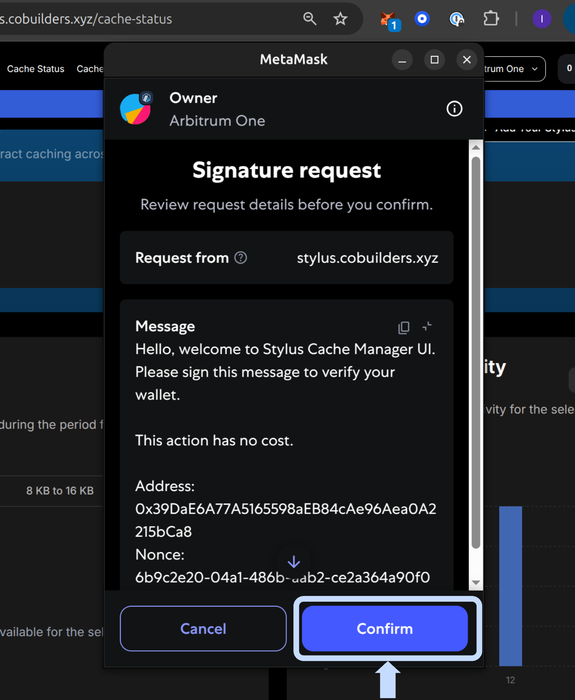
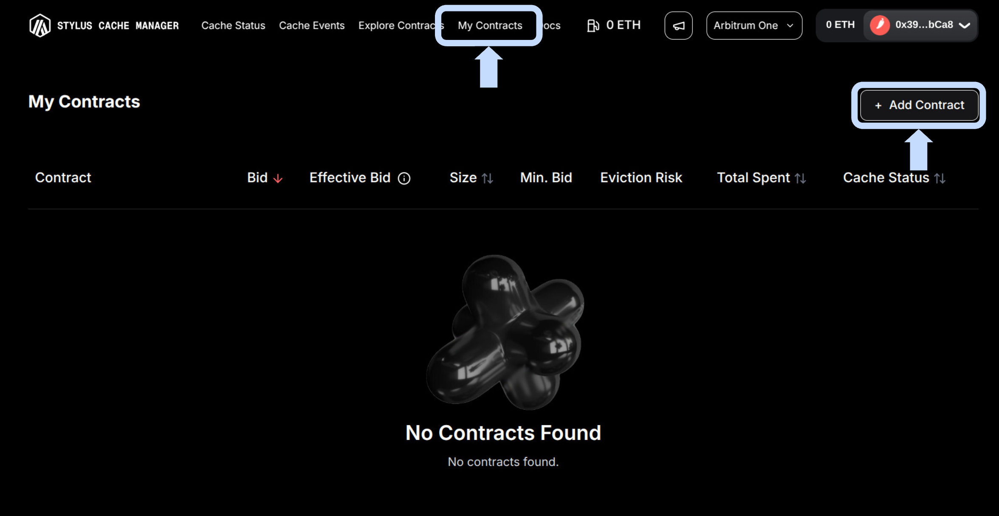

# **👆 Common Interactions**

> **Get started fast!** Here's how to use the Stylus Cache Manager UI for the most important actions—step by step, with visuals to guide you.

---

## **🔐 1. Login with Wallet**

Open the [Stylus Cache Manager](https://stylus.cobuilders.xyz) web app.

Click the **Connect Wallet** button in the top right corner.

<figure markdown="span">
  { width="700" }
</figure>

Select your wallet provider (e.g., MetaMask, WalletConnect).

<figure markdown="span">
  { width="700" }
</figure>

Approve the connection in your wallet popup.

<figure markdown="span">
  { width="700" }
</figure>

When prompted, sign the authentication message to log in securely.

<figure markdown="span">
  { width="700" }
</figure>

---

## **📋 2. Add a Contract to "My Contracts"**

After logging in, go to the **My Contracts** section from the navbar and Click **+ Add Contract** button.

<figure markdown="span">
  { width="700" }
</figure>

Enter your contract address

<figure markdown="span">
  { width="700" }
</figure>

and (optionally) a label or description.

<figure markdown="span">
  { width="700" }
</figure>

Click **Add Contract**. The contract will now appear in your list.

<figure markdown="span">
  { width="700" }
</figure>

When clicking a contract, details panel will show up

<figure markdown="span">
  { width="700" }
</figure>

---

## **💰 3. Place a Bid**

!!! example "Place a bid for a cache slot"

1. In **My Contracts**, select the contract you want to manage.
2. Enter your bid amount in Bid Now section and confirm the transaction details.
3. Approve the transaction in your wallet (MetaMask or similar).
4. Wait for confirmation the UI will update your contract's cache status.

---

!!! tip "Want to explore more?"
Check out the next sections for automation, alerts, and advanced analytics! (WIP)
