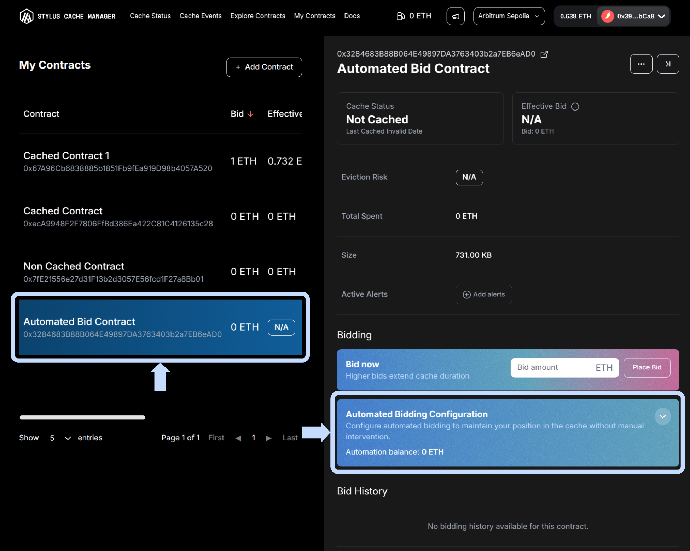
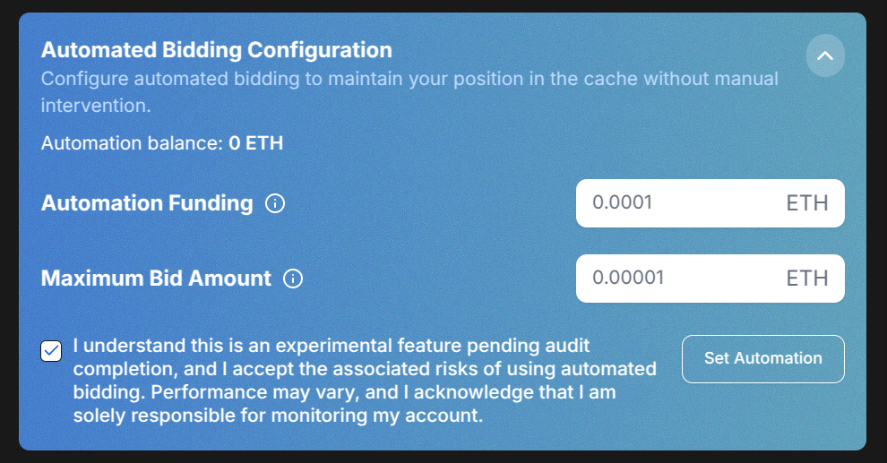
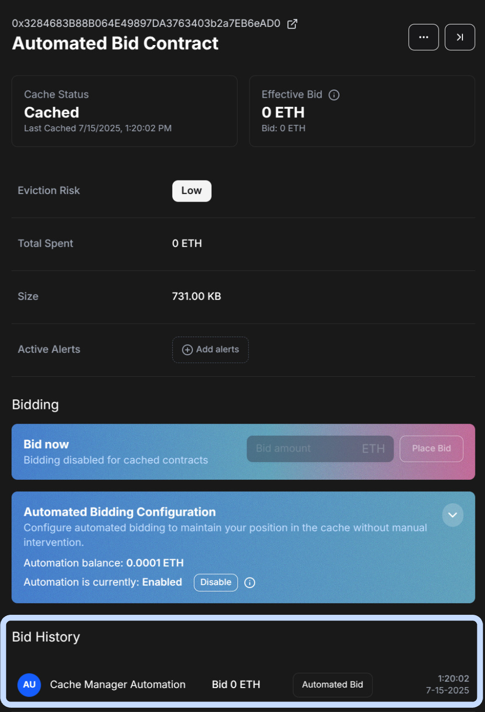
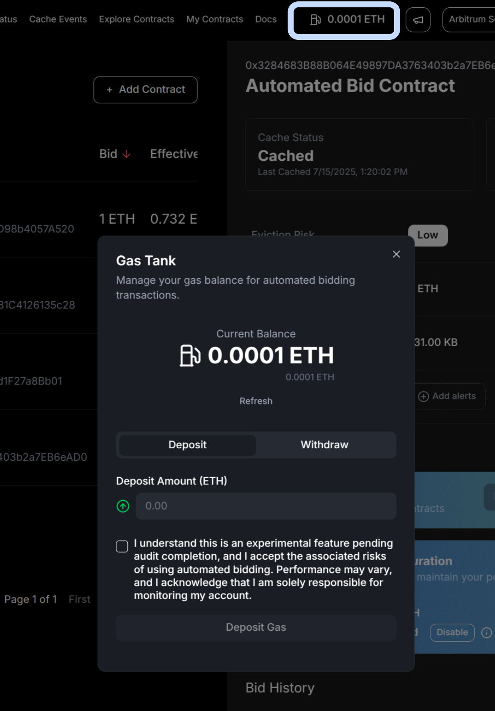

# **Common Interactions**

> **Get started fast!** Here's how to use the Stylus Cache Manager UI for the most important actions—step by step, with visuals to guide you.

---

## **⚙️ Bid Automation**

Automated bidding keeps your contract cached without manual intervention.
To get started, go to **My Contracts** and select the contract you want to automate.

<figure markdown="span">
  { width="600" }
</figure>

Enter the amount of ETH to deposit into the automation balance.
This balance will be used to place bids automatically on your behalf.
You can enter `0` if you prefer to fund it later (via the **Gas Tank** in the navbar) or if your balance already has sufficient funds.

Define the highest amount the system is allowed to bid on your behalf.

Click “Set Automation”. Once confirmed, your contract will auto-bid to maintain its position.

<figure markdown="span">
  { width="600" }
</figure>

When your configuration meets the bidding conditions,
the backend will trigger the Cache Manager Automation (CMA) contract to place a bid on your behalf.
The bid amount will be deducted from your automation balance, and your contract will be cached automatically.

<figure markdown="span">
  { width="400" }
</figure>

You can view your automation balance in the **Automation** tab or under the **Gas Tank** section in the navbar.

<figure markdown="span">
  { width="400" }
</figure>

---
