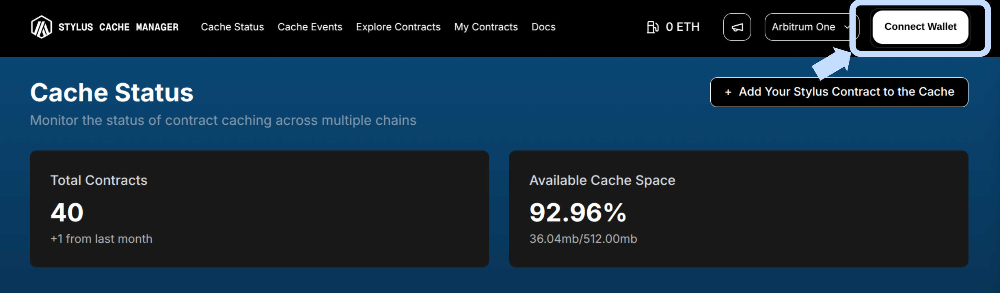
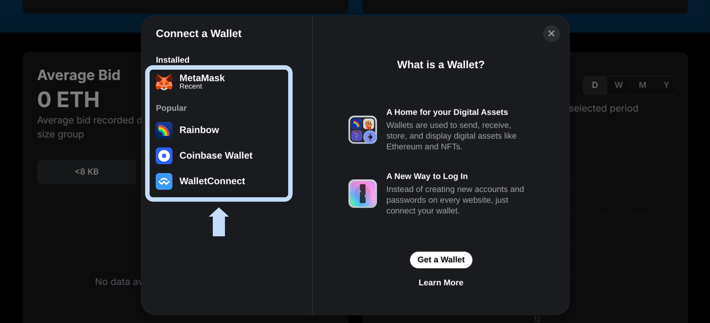
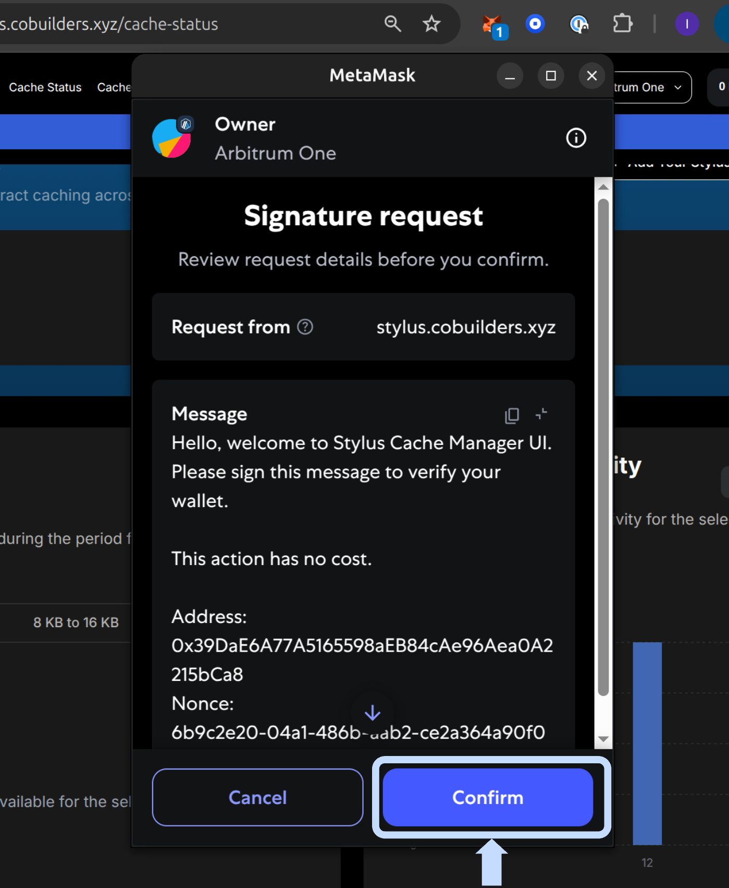

# **Common Interactions**

> **Get started fast!** Here's how to use the Stylus Cache Manager UI for the most important actions—step by step, with visuals to guide you.

---

## **🔐 Login with Wallet**

Open the [Stylus Cache Manager](https://stylus.cobuilders.xyz) web app.

Click the **Connect Wallet** button in the top right corner.

<figure markdown="span">
  { width="700" }
</figure>

Select your wallet provider (e.g., MetaMask, WalletConnect).

<figure markdown="span">
  { width="700" }
</figure>

Approve the connection in your wallet popup.

<figure markdown="span">
  { width="400" }
</figure>

When prompted, sign the authentication message to log in securely.

<figure markdown="span">
  { width="400" }
</figure>

---
