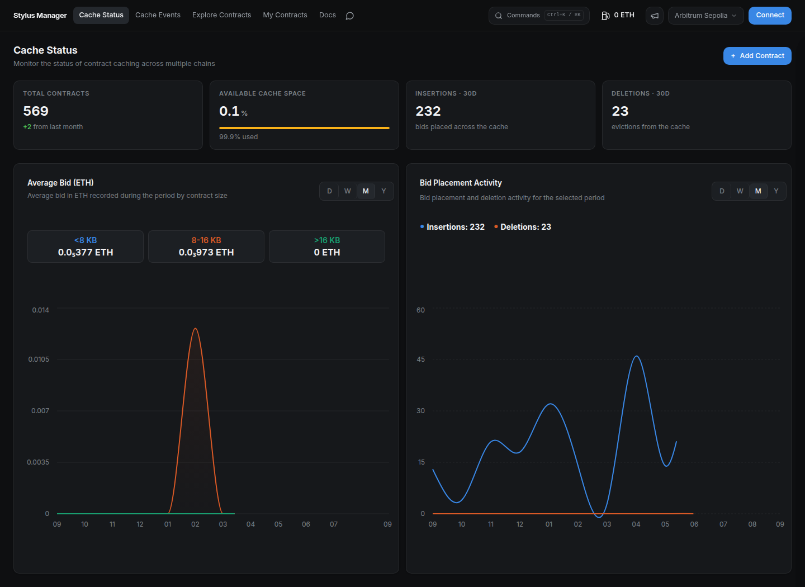
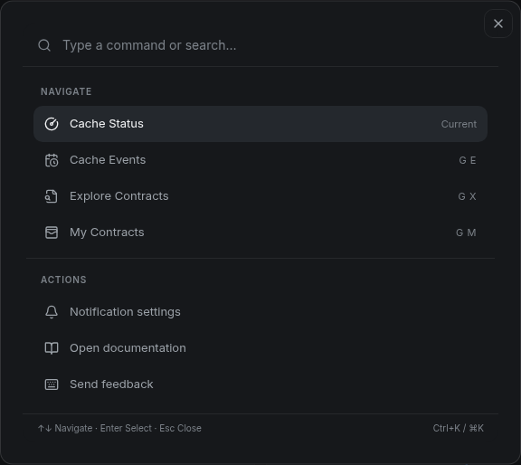

# **🖥️ Stylus Manager UI: Overview**

> **Manage activation and caching in one place.** Open [Stylus Manager](https://stylus.cobuilders.xyz), select a network, and inspect the public dashboards before connecting a wallet.

---

## **📊 Find your way around**

| Section | What you will find |
| --- | --- |
| **Cache Status** | Cache capacity, total contracts, 30-day insertions and deletions, average bids, and activity charts. |
| **Cache Events** | Searchable blockchain cache events and transaction details. |
| **Explore Contracts** | Contracts indexed on the selected network, with search, filters, and pagination. |
| **My Contracts** | Your saved contracts, activation and cache status, and per-contract actions. Requires wallet login. |

<figure markdown="span">
  { width="1000" }
  <figcaption>Public app capture, September 11, 2026. Metrics change with network activity.</figcaption>
</figure>

## **⚡ Two tabs per contract**

- **Activation:** inspect activation status and lifetime, activate manually, configure auto-activation, and review automation history.
- **Cache:** inspect cache status, effective bid and eviction risk, place a manual bid, configure automated bidding, and review bid history.

Both tabs expose the contract's alerts. The header provides **Gas Tank**, notification settings, the network selector, and wallet connection.

## **⌨️ Keyboard navigation**

Open **Commands** with **Ctrl+K**, **⌘K**, or **?**. Use the arrow keys to select an action, **Enter** to run it, and **Esc** to close.

<figure markdown="span">
  { width="850" }
</figure>

| Shortcut | Action |
| --- | --- |
| **G**, then **C** | Cache Status |
| **G**, then **E** | Cache Events |
| **G**, then **X** | Explore Contracts |
| **G**, then **M** | My Contracts |
| **/** | Focus the current table's search field. |

Single-key shortcuts apply when you are not typing in a form field.

## **🚀 Start a workflow**

1. [Connect and sign in](tutorials/login-wallet.md).
2. [Add a contract](tutorials/my-contracts.md) and check its activation state.
3. [Activate it](tutorials/activation.md), then optionally [place a cache bid](tutorials/place-bid.md).
4. Fund the [Gas Tank](tutorials/gas-tank.md), configure [auto-activation](tutorials/auto-activation.md) or [bid automation](tutorials/bid-automation.md), and [set alerts](tutorials/alerts.md).

!!! info "About the tutorial snapshots"

    The wallet tutorials reuse recorded sessions with disposable contracts. The activation and caching lifecycle snapshots use the local devnode, where expiration and eviction can be reproduced. Addresses, balances, dates, and network labels are examples; use your own selected network and current values. Wallet-provider dialogs can vary by version.
