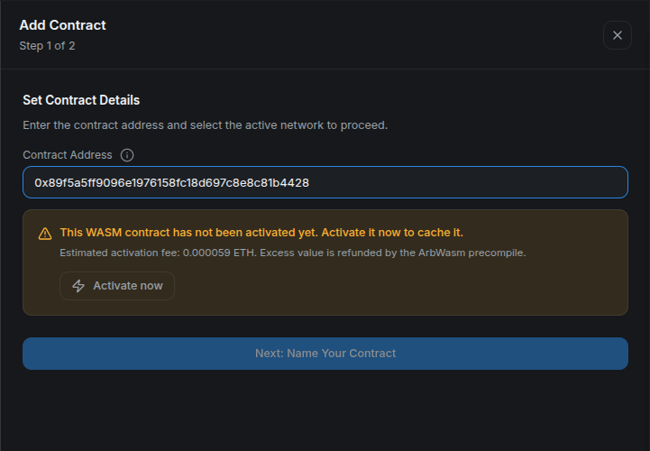
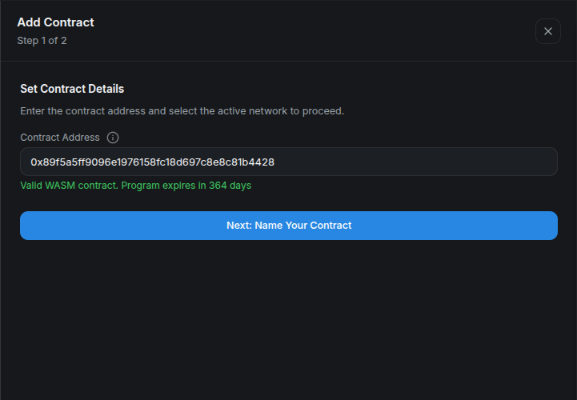
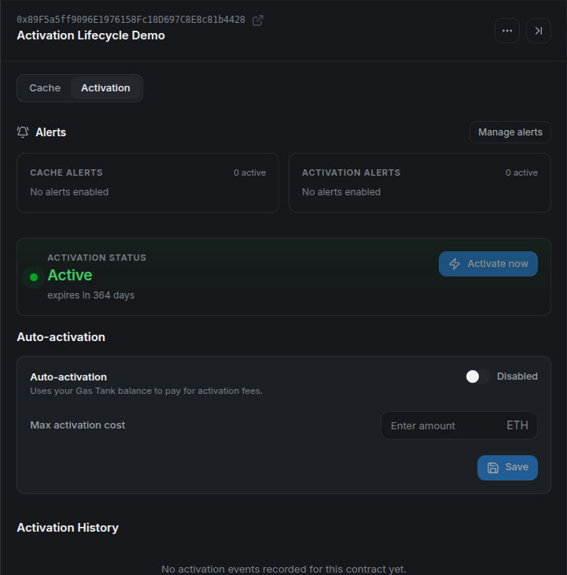
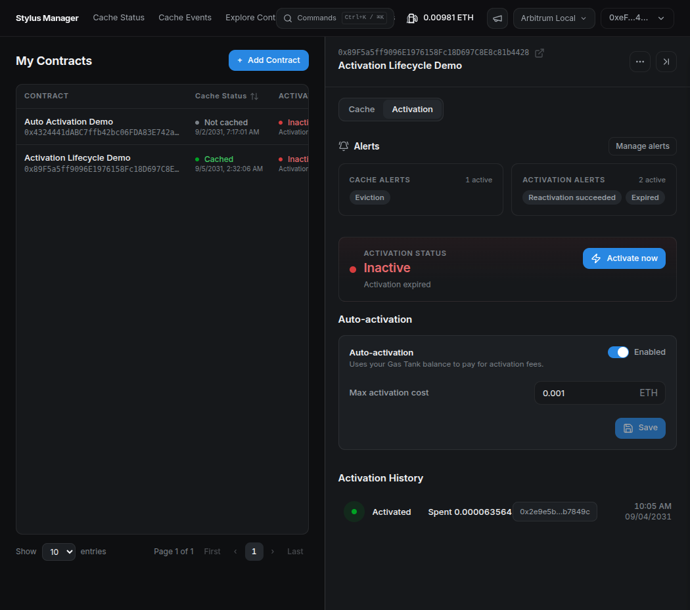

# **⚡ Activate a Contract**

> **Make a deployed Stylus program executable.** First connect your wallet and select the program's network. Manual activation is paid from your wallet.

## **Step 1: Check the program**

In **My Contracts**, select **Add Contract** and enter the deployed address. The app checks the bytecode and activation state. For a program that has never been activated, the validation step offers **Activate now** with a fee estimate.

<figure markdown="span">
  { width="700" }
</figure>

## **Step 2: Activate and confirm**

Select **Activate now**, switch the wallet network if prompted, and review the value and gas in the wallet. Confirm the transaction and wait for its receipt. An estimate or submitted transaction alone does not confirm activation.

<figure markdown="span">
  { width="700" }
</figure>

Once the program is active, continue to the name step and add it to **My Contracts**.

## **Step 3: Monitor its lifetime**

Open the saved contract and choose **Activation**. Verify **Active** and the remaining lifetime. The displayed lifetime depends on the chain and its current protocol settings.

<figure markdown="span">
  { width="700" }
</figure>

## **Reactivate an existing contract**

When the tab reports **Activation expired** or **Needs upgrade to current Stylus version**, use **Activate now** again. A mobile contract's **Activate** action opens this tab directly.

<figure markdown="span">
  { width="700" }
</figure>

After confirmation, refresh and verify the renewed active state. If the state is **Unknown**, retry the status read before assuming the program needs a transaction. If an attempt fails, inspect the displayed error and transaction details.

Direct wallet activation updates the program's state, but **Activation History** currently lists CMA automation events. Use the wallet receipt or explorer for a direct activation transaction.

Next: [Auto-activation](auto-activation.md), or the [Cargo and Hardhat activation tutorial](../../../tutorials/activation.md).
