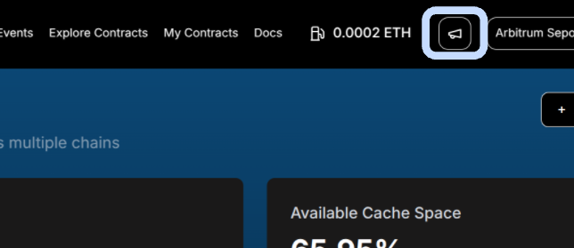
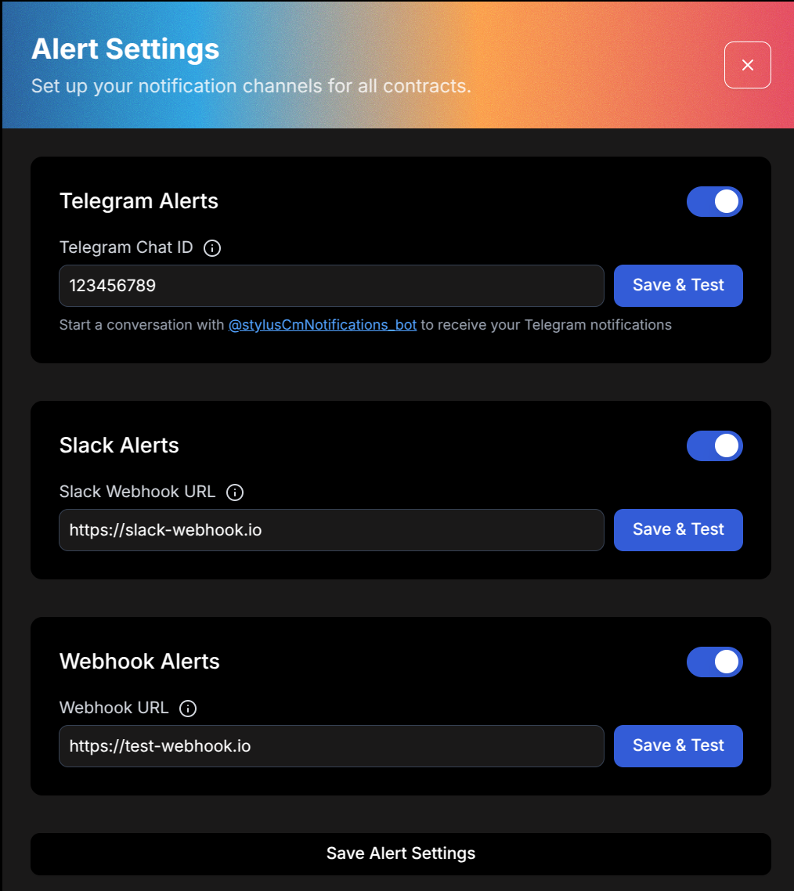
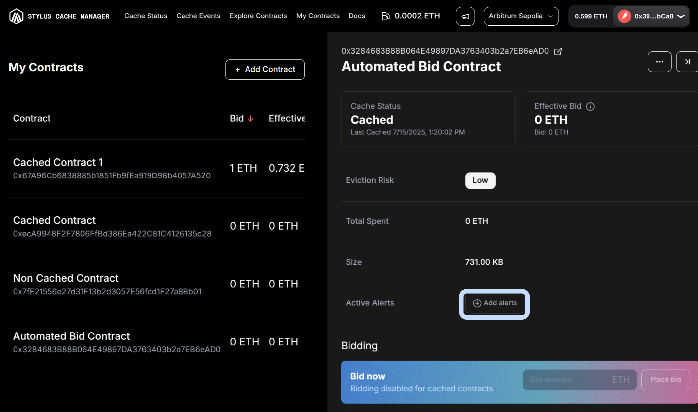
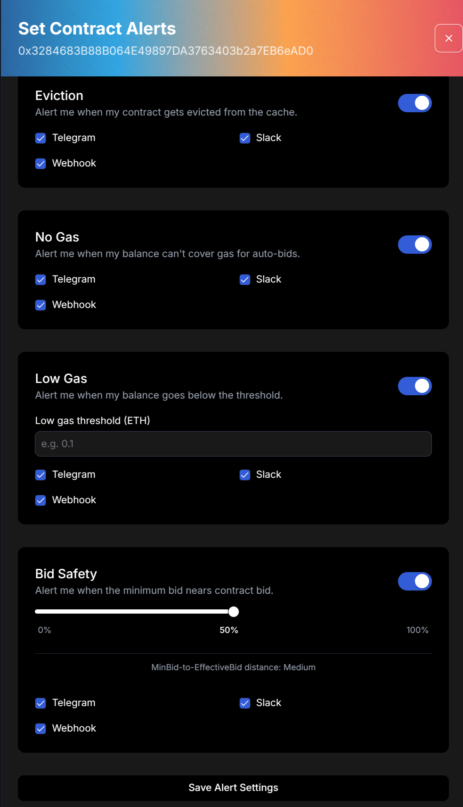

# **Tutorials**

> **Get started fast!** Here's how to use the Stylus Cache Manager UI for the most important actions—step by step, with visuals to guide you.

---

## **🔔 Set Up Alerts**

Stay informed with real-time alerts for key contract events.

To start, open the **Alert Settings** section to configure your preferred notification channels.

<figure markdown="span">
  { width="500" }
</figure>

### **Step 1: Configure Your Notification Channels**

You can choose from the following options:

- **Telegram** — Set your Telegram Chat ID and start a conversation with [@stylusCmNotifications_bot](https://t.me/stylusCmNotifications_bot).
- **Slack** — Provide a valid Slack Webhook URL.
- **Webhook** — Use any compatible Webhook endpoint for custom integrations.

Each channel has a **Test** button to validate the connection before saving.

<figure markdown="span">
  { width="500" }
</figure>

Once you're done, click **Save Alert Settings** to apply your global channel configuration.

---

### **Step 2: Enable Alerts for a Specific Contract**

Select the contract you want to monitor and go to **Set Contract Alerts** and

<figure markdown="span">
  { width="600" }
</figure>

You’ll see the following alert types:

- **Eviction** — Notifies you when your contract is evicted from the cache.
- **No Gas** — Alerts you when your gas balance is insufficient for automated bidding.
- **Low Gas** — Triggers when your balance drops below a custom threshold.
  → You can set the threshold manually in ETH.
- **Bid Safety** — Warns you when the minimum bid approaches your current bid.
  → Use the slider to adjust the sensitivity.

For each alert type, select the channels where you want to receive notifications:

- Telegram
- Slack
- Webhook

<figure markdown="span">
  { width="400" }
</figure>

When finished, click **Save Alert Settings** to confirm your preferences for that contract.

---
