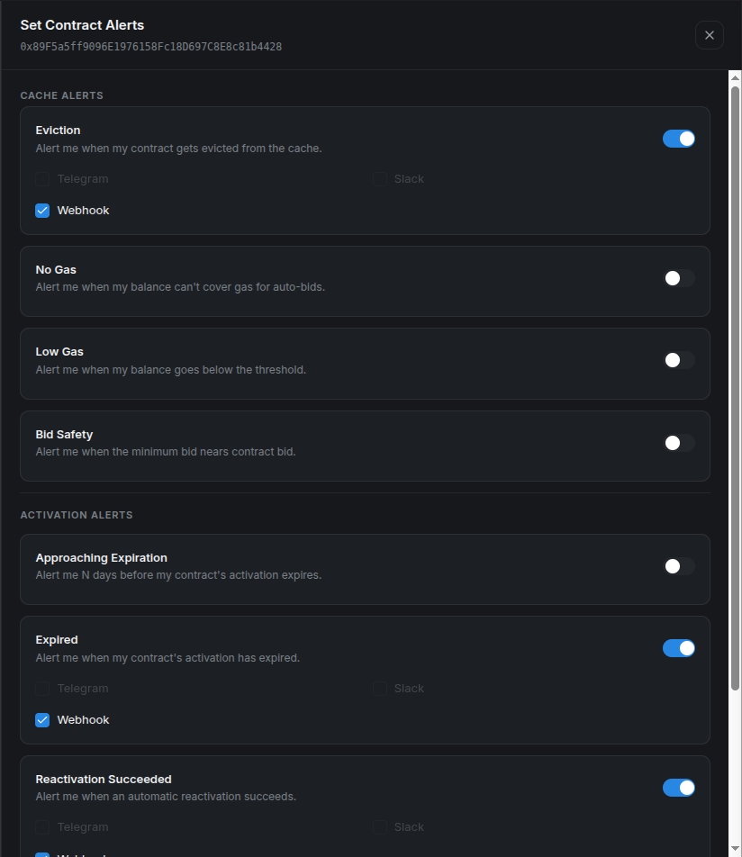

# **🔔 Set Up Alerts**

> **Monitor both contract activation and caching.** Configure delivery channels once, then enable the alert types and channels for each saved contract.

## **Step 1: Configure delivery channels**

Open the notification settings icon in the header, or choose **Notification settings** from **Commands**.

- **Telegram:** start the configured notification bot and enter your chat ID.
- **Slack:** enter an incoming webhook URL.
- **Webhook:** enter an endpoint for your own receiver.

Use the channel's test action and save the configuration.

<figure markdown="span">
  { width="700" }
</figure>

The endpoint in the snapshot is a throwaway tutorial destination. Use your own destination for delivery.

## **Step 2: Choose contract alerts**

Open the contract and select **Manage alerts**, or **Contract Alerts** from its actions menu. Choose channels for each enabled alert.

| Cache alert | Trigger or setting |
| --- | --- |
| **Eviction** | The program leaves the cache. |
| **No Gas** | The user's automation balance is empty. |
| **Low Gas** | The balance falls below the threshold you set in ETH. |
| **Bid Safety** | The current auction minimum approaches the effective bid, using your configured margin. |

<figure markdown="span">
  { width="700" }
</figure>

| Activation alert | Trigger or setting |
| --- | --- |
| **Approaching expiration** | Remaining activation lifetime falls within your configured number of days. |
| **Expired** | The expiration check finds no remaining activation lifetime. |
| **Reactivation succeeded** | CMA reports a successful activation. |
| **Reactivation failed** | CMA reports a failed activation attempt. |

<figure markdown="span">
  { width="700" }
</figure>

A required Stylus upgrade is visible in activation status and supported by auto-activation, but the current expiration-alert evaluator does not explicitly turn that error into an Expired notification.

Expiration monitoring and automation success/failure are different signals. A direct wallet activation can restore the state without generating a CMA reactivation alert.

## **Step 3: Save and verify**

Select **Save Alert Settings**. Return to the contract and check the **Cache alerts** and **Activation alerts** summaries.

<figure markdown="span">
  { width="700" }
</figure>

Some alerts follow indexed events; others run on periodic checks. Indexing delay, channel delivery, cooldowns, and retry backoff affect when a notification arrives. This release has no dedicated “re-cached” alert: verify cache recovery through status and **Bid History**.

For recorded webhook payloads and controlled local tests, see the [activation tutorial](../../../tutorials/activation.md#set-up-activation-alerts) and [caching tutorial](../../../tutorials/caching.md#set-up-cache-alerts).
