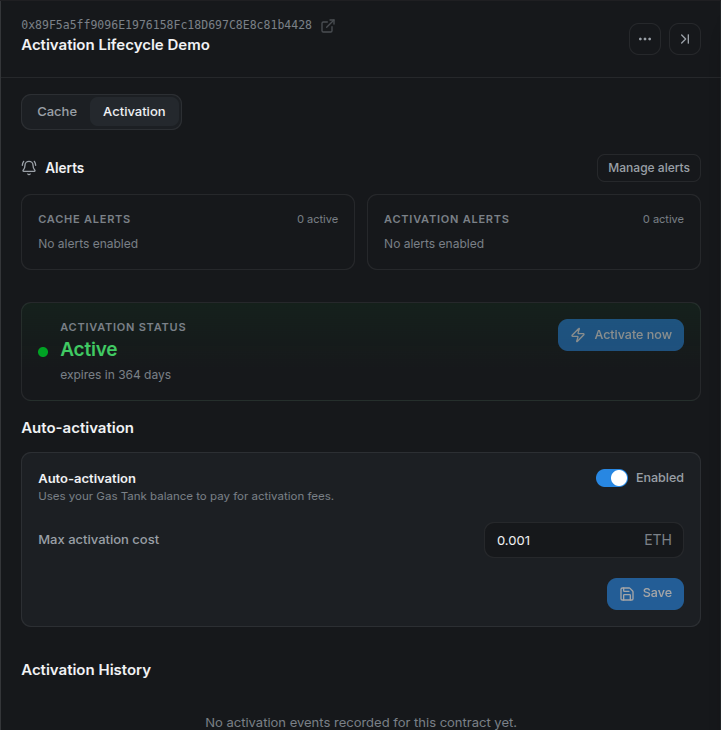

# **🤖 Configure Auto-activation**

> **Reactivate after expiry or a required Stylus upgrade.** First activate the program manually and save it in **My Contracts**. Auto-activation is independent from automated cache bidding.

## **Step 1: Fund the Gas Tank**

Open the header's **Gas Tank** and deposit ETH on the selected network. Wait for the confirmed balance. This balance is shared with your automated cache bids.

See [Gas Tank](gas-tank.md) for the deposit and withdrawal steps.

## **Step 2: Set an activation limit**

Open the contract's **Activation** tab, enable **Auto-activation**, and enter **Max activation cost** in ETH.

<figure markdown="span">
  { width="700" }
</figure>

The maximum must be positive when enabled and within the CMA's configured funding limit. The Gas Tank must cover the **full maximum** for the contract to be eligible, even if an earlier activation cost less. This is a per-attempt limit, not a total lifetime budget.

Select **Save**, confirm the configuration transaction, and wait for confirmation. Saving activation settings preserves the existing bidding settings.

## **Step 3: Verify the configuration**

Check that auto-activation is **Enabled**, the maximum matches your choice, and the Gas Tank has enough funds.

<figure markdown="span">
  { width="700" }
</figure>

The worker checks eligible programs periodically. It skips programs that are still active and programs that have never been activated. A backend operator must also have activation automation enabled for that deployment.

!!! info "Reactivation timing"

    This feature reacts to expiration or a required upgrade. It does not perform preventive keepalive. There can be a gap before recovery, and failed attempts are subject to retry limits and backoff.

## **Step 4: Check recovery and alerts**

After successful automation, verify the active state, Gas Tank balance, and an **Activated** entry in **Activation History**.

<figure markdown="span">
  { width="700" }
</figure>

Enable [expiration and reactivation alerts](alerts.md) to follow the result. If no transaction appears, check the maximum cost, shared balance, current program state, and the backend's automation status. An **Error** state may require operator investigation after retries are exhausted.

To stop automatic reactivation, turn off **Auto-activation**, save, and confirm the transaction. Automated cache bidding has its own control.

For refund behavior and retry details, see [Activation Lifecycle](../../../deep-dive/activation-lifecycle.md).
