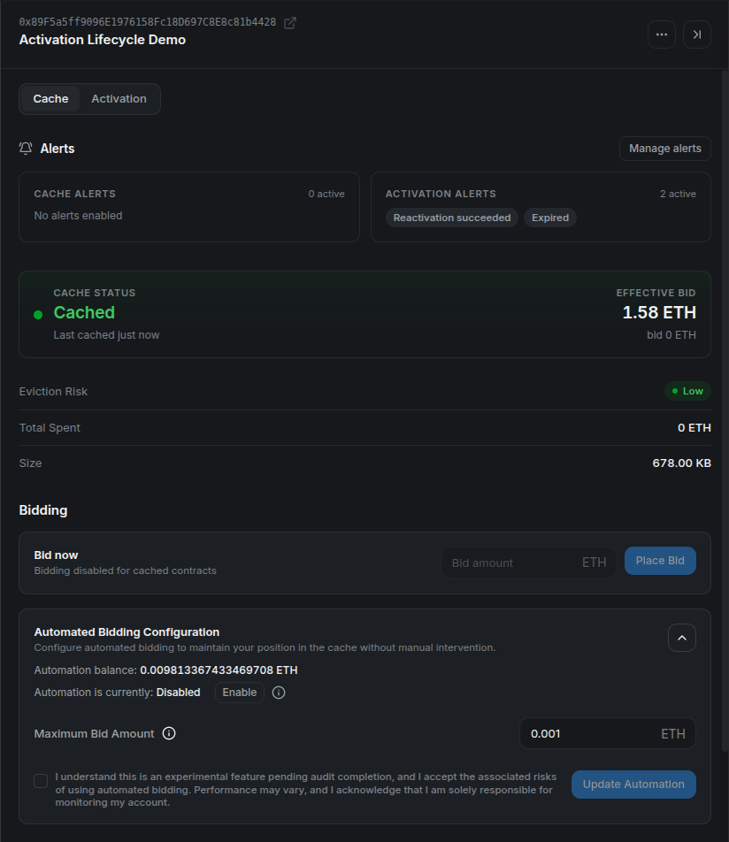
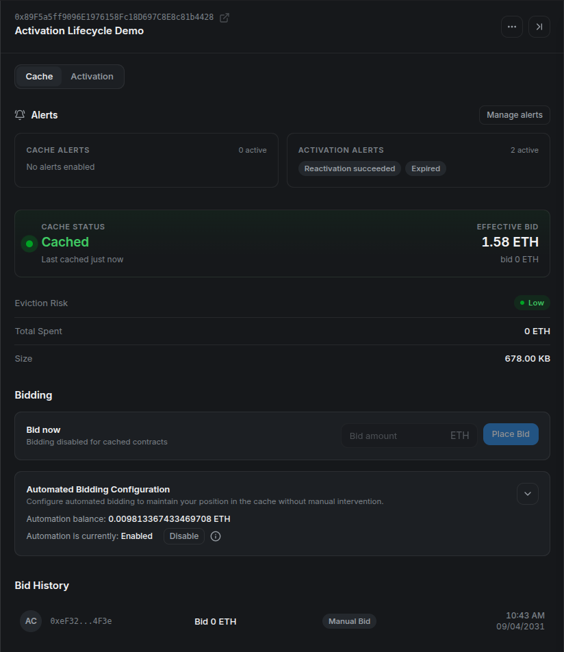

# **⚙️ Configure Cache Bid Automation**

> **Let the worker bid when your program needs a cache slot.** Automated bidding and auto-activation have separate controls and share the same Gas Tank.

## **Step 1: Fund your balance**

Deposit ETH through the [Gas Tank](gas-tank.md) if your available balance is insufficient. Depositing and saving a configuration are separate actions.

## **Step 2: Set the maximum bid**

In **My Contracts**, open the program's **Cache** tab and expand **Automated Bidding Configuration**. Enter **Maximum Bid Amount**, read the experimental-feature acknowledgement, and select the setup or update action shown for the current registration.

<figure markdown="span">
  { width="700" }
</figure>

The maximum is a **per-bid ceiling**, not the amount the worker must spend or a total budget. CMA enforces a minimum allowed maximum (`minMaxBidAmount`), including when bidding is disabled. This configuration floor differs from the current auction minimum, which can be zero.

Confirm the wallet transaction. If automation still reads **Disabled**, select **Enable** and confirm that transaction too. Saving a maximum and enabling bidding can require separate confirmations.

## **Step 3: Verify the enabled state**

<figure markdown="span">
  { width="700" }
</figure>

Check **Enabled**, the saved maximum, and the remaining balance. Changing bidding settings preserves the contract's auto-activation settings.

No immediate bid is expected if the program is already cached. The worker can also skip a contract when it is inactive, the required bid exceeds the maximum, the balance is insufficient, or the deployment's bidding worker is disabled.

## **Step 4: Monitor recovery**

After eviction, a successful automated bid appears in **Bid History** and the status returns to **Cached**.

<figure markdown="span">
  { width="700" }
</figure>

To stop automated bidding, use **Disable** and confirm. This leaves auto-activation independent. Removing the on-chain CMA registration removes both configurations; removing an item from **My Contracts** only removes the saved list entry.

See [Cache Bid Automation](../../../deep-dive/bid-automations.md) for selection rules and [the v2 release notes](../../../releases/stylus-manager-v2.md#contract-audit) for the published audit and the older acknowledgement wording visible in snapshots.
