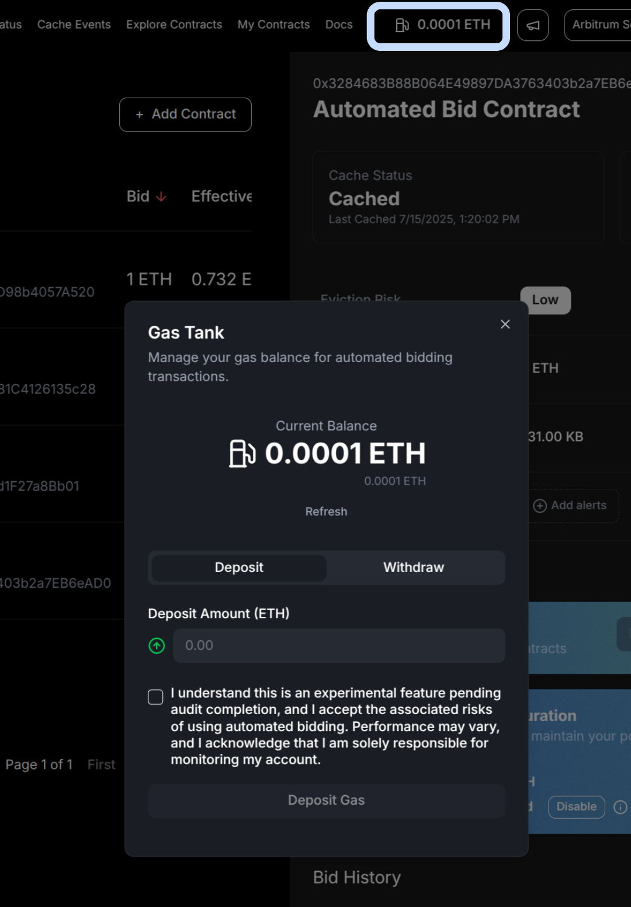
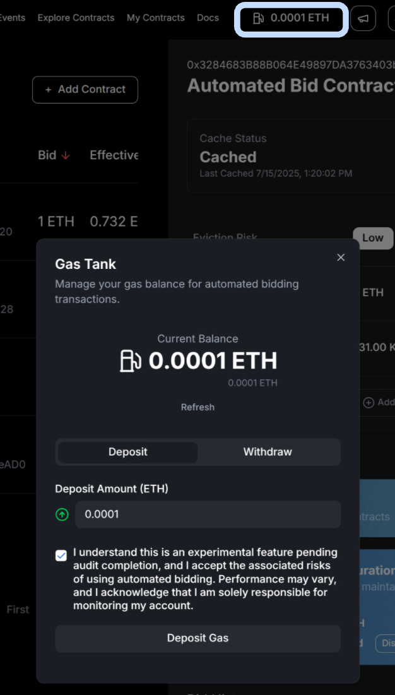
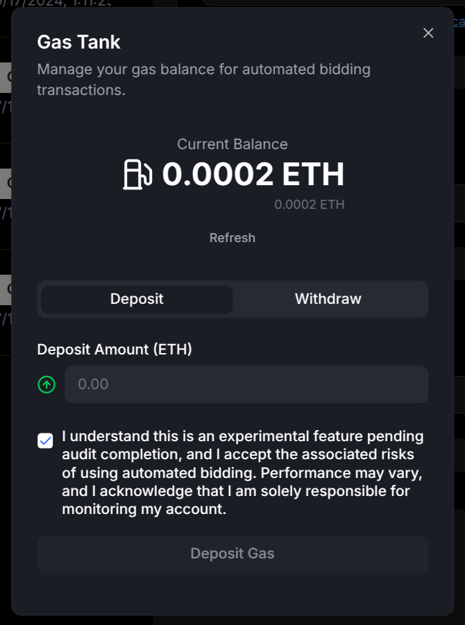
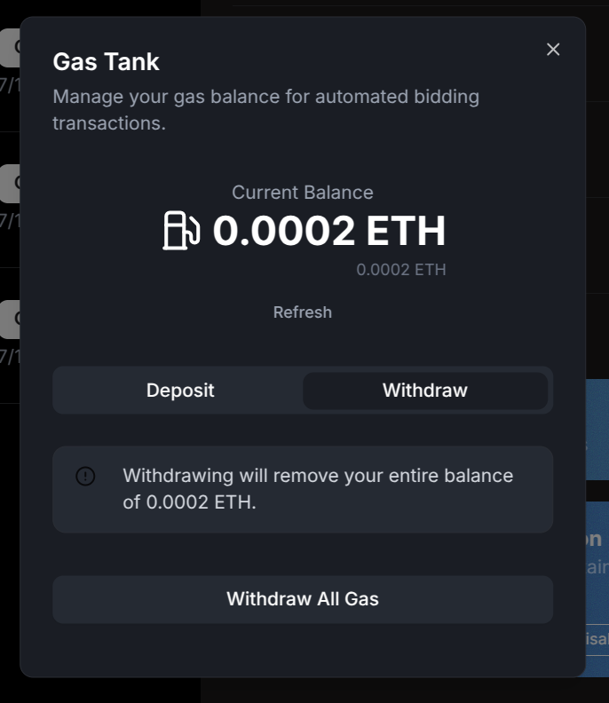

# **Tutorials**

> **Get started fast!** Here's how to use the Stylus Cache Manager UI for the most important actions—step by step, with visuals to guide you.

---

## **⛽ Manage Gas Tank**

The **Gas Tank** holds the ETH balance used for automated bidding transactions.

To deposit funds, open the **Gas Tank** from the navbar.

<figure markdown="span">
  { width="400" }
</figure>

Enter the amount of ETH you want to deposit.
This balance will be used when the automation logic places a bid on your behalf.

Click **Deposit Gas** and confirm the transaction in your wallet.

<figure markdown="span">
  { width="400" }
</figure>

After the transaction is confirmed, your updated balance will be reflected in the Gas Tank.

<figure markdown="span">
  { width="400" }
</figure>

To withdraw your funds, switch to the Withdraw tab—you can withdraw the full balance at any time.

<figure markdown="span">
  { width="400" }
</figure>

---
