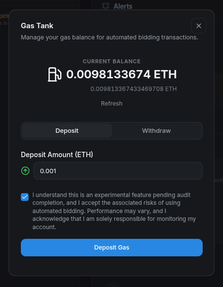
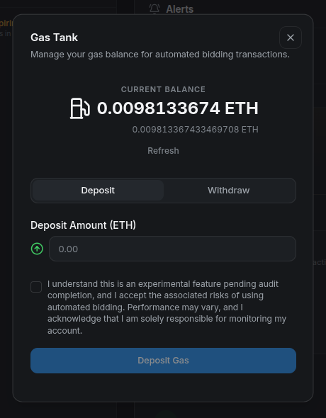
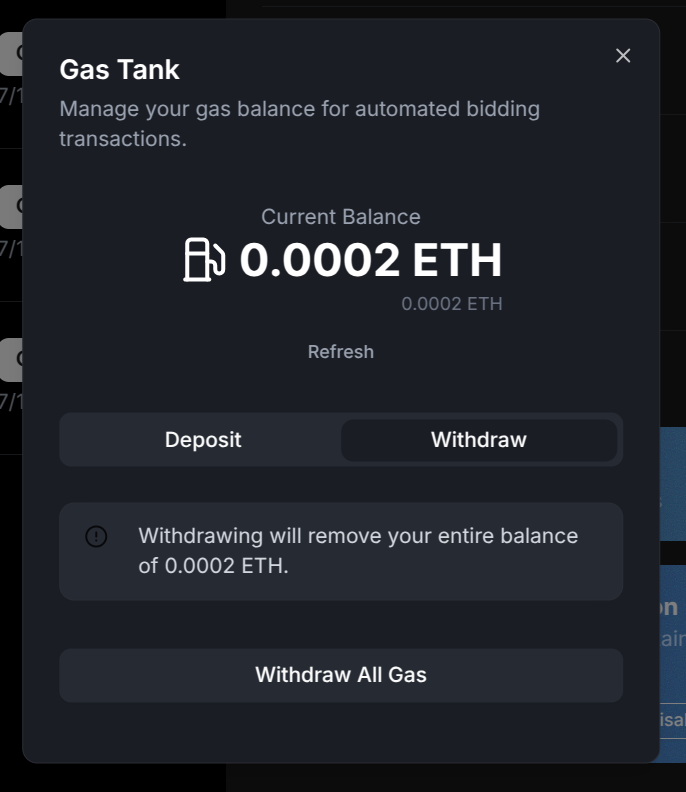

# **⛽ Manage the Gas Tank**

> **One automation balance for activation and caching.** The Gas Tank holds your ETH in the selected CMA deployment's escrow. Both automated cache bids and automated activations draw from it.

## **Step 1: Deposit funds**

Select the Gas Tank balance in the header, open **Deposit**, and enter an amount in ETH. Read the acknowledgement, select **Deposit Gas**, and confirm the wallet transaction.

<figure markdown="span">
  { width="500" }
</figure>

The deposit must meet the deployment's minimum deposit and maximum user-balance limits. Wait for confirmation, then refresh the balance.

<figure markdown="span">
  { width="600" }
</figure>

## **Step 2: Budget for both automations**

Cache bids can reduce the balance available for a future activation, and vice versa. For auto-activation to run, the available balance must cover the full configured **Max activation cost**. Each limit applies to one operation; future operations can spend again while enabled and funded.

Manual activation and manual bidding use your wallet directly. Keep wallet ETH available for transaction gas when saving settings, depositing, withdrawing, or acting manually.

!!! info "Balances are deployment-specific"

    Changing the chain or moving from CMA v1 to v2 selects a different escrow balance. Existing deposits are not automatically transferred. See the [v2 upgrade notes](../../../releases/stylus-manager-v2.md#upgrading-to-stylus-manager-v2).

## **Step 3: Withdraw unused funds**

Open **Withdraw**, review the available balance, and select **Withdraw All Gas**. Confirm the transaction and verify that the Gas Tank balance updates.

<figure markdown="span">
  { width="500" }
  <figcaption>This wallet-flow snapshot predates the v2 visual refresh; the current action is Withdraw All Gas.</figcaption>
</figure>

The current UI withdraws the **entire unused balance** to your connected account. Withdrawal does not switch off your automation settings. Disable the relevant controls as well if you want to stop future automation after funding again.

Some retained UI text describes the balance as bidding-only or says an audit is pending. The balance also funds activation; the contracts v2 audit is linked in [the release notes](../../../releases/stylus-manager-v2.md#contract-audit).
