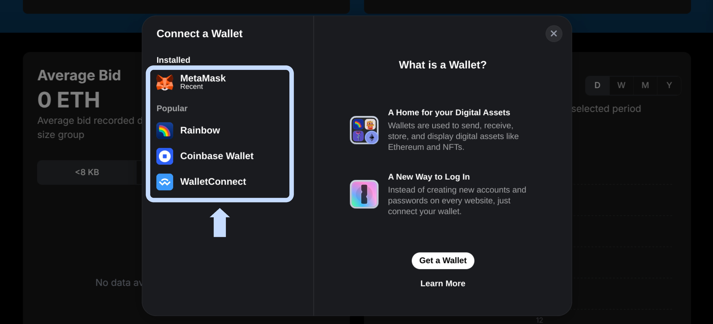
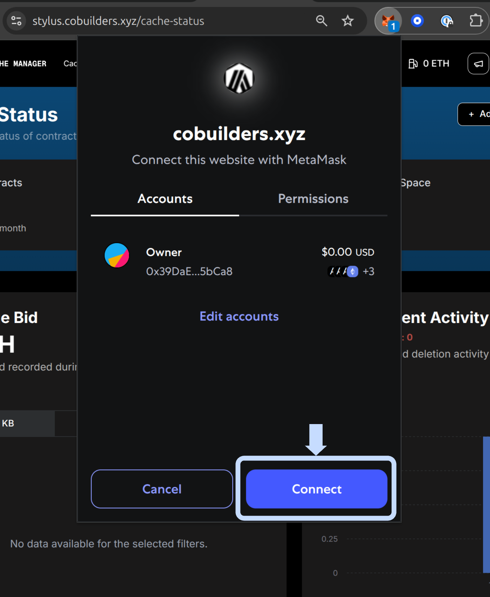
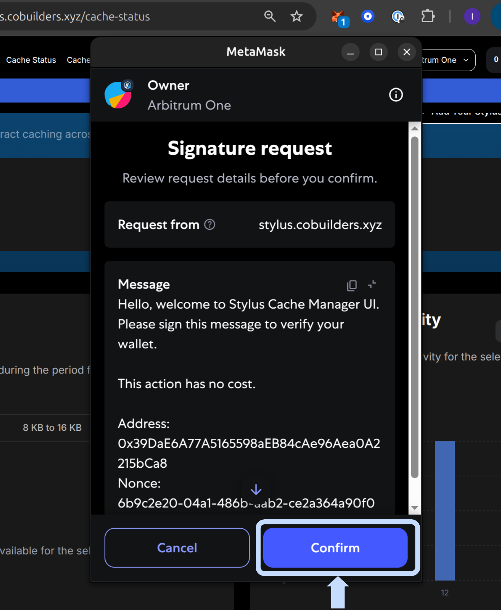

# **🔐 Login with Wallet**

> **Connect your wallet and sign in** to save contracts, configure alerts, and manage activation and caching.

---

## **Step 1: Connect your wallet**

Open the [Stylus Manager](https://stylus.cobuilders.xyz) web app.

Select the network in the header, then click **Connect** in the top right corner. Older snapshots label this action **Connect Wallet**.

<figure markdown="span">
  { width="700" }
</figure>

Select your wallet provider (e.g., MetaMask, WalletConnect).

<figure markdown="span">
  { width="700" }
</figure>

Approve the connection in your wallet popup.

<figure markdown="span">
  { width="400" }
</figure>

## **Step 2: Sign in**

When prompted, sign the authentication message to log in securely.

<figure markdown="span">
  { width="400" }
</figure>

---

!!! info "Wallet snapshots"

    The provider-selection, connection, and signing images above are retained from an earlier wallet session. The dialog appearance depends on your wallet version. The current backend's authentication message still uses the former product name.

Signing the login message authenticates your account without sending an on-chain transaction. Activating, bidding, depositing, withdrawing, and saving automation settings require separate wallet transactions. If the wallet and app networks differ, switch to the selected network before submitting a write.

Next: [Add a Contract](my-contracts.md).
