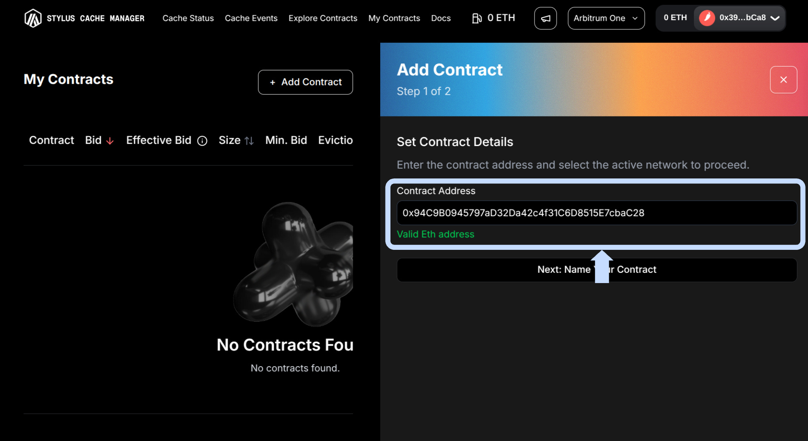
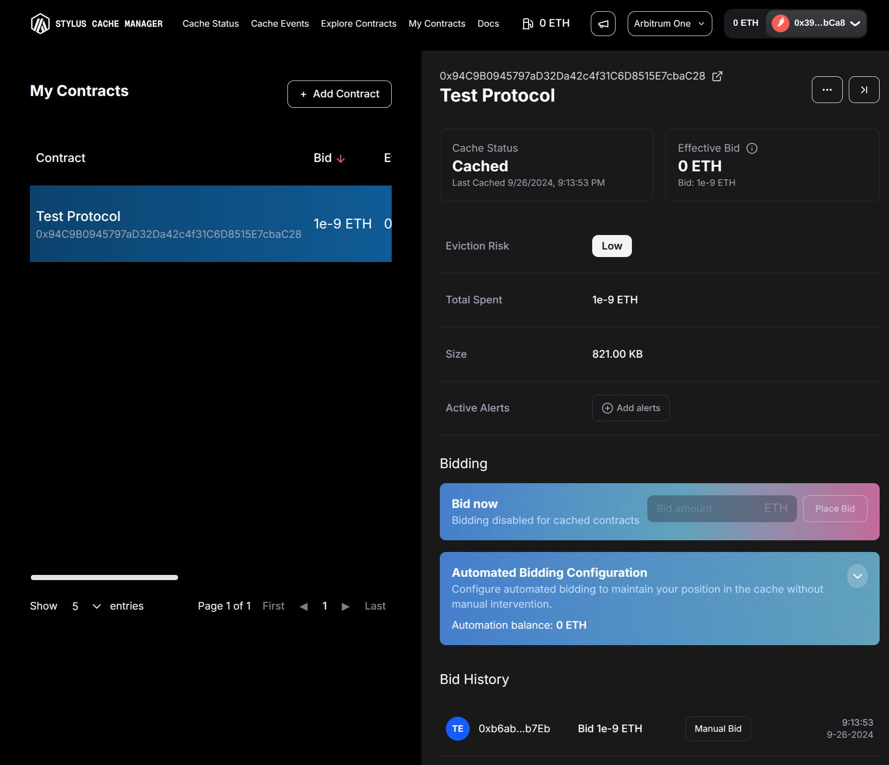

# **Tutorials**

> **Get started fast!** Here's how to use the Stylus Cache Manager UI for the most important actions—step by step, with visuals to guide you.

---

## **📋 Add a Contract to "My Contracts"**

After logging in, go to the **My Contracts** section from the navbar and Click **+ Add Contract** button.

<figure markdown="span">
  { width="700" }
</figure>

Enter your contract address

<figure markdown="span">
  { width="700" }
</figure>

and (optionally) a label or description.

<figure markdown="span">
  { width="700" }
</figure>

Click **Add Contract**. The contract will now appear in your list.

<figure markdown="span">
  { width="700" }
</figure>

When clicking a contract, details panel will show up

<figure markdown="span">
  { width="700" }
</figure>

---
