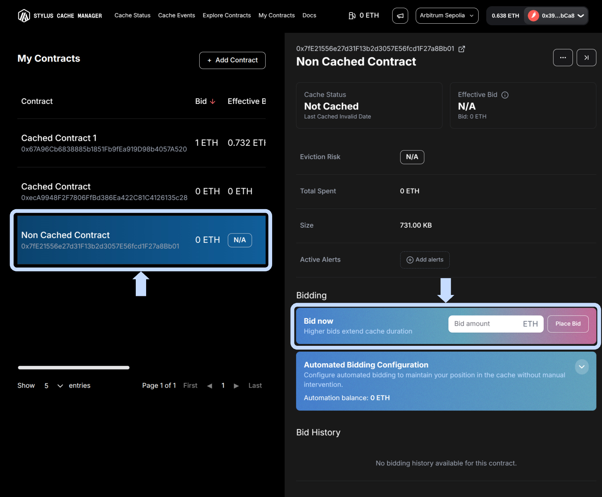
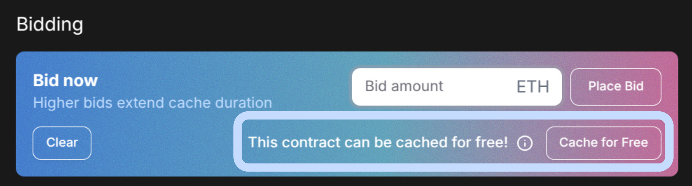
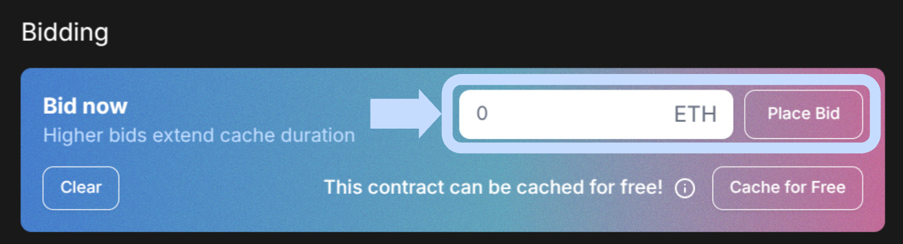
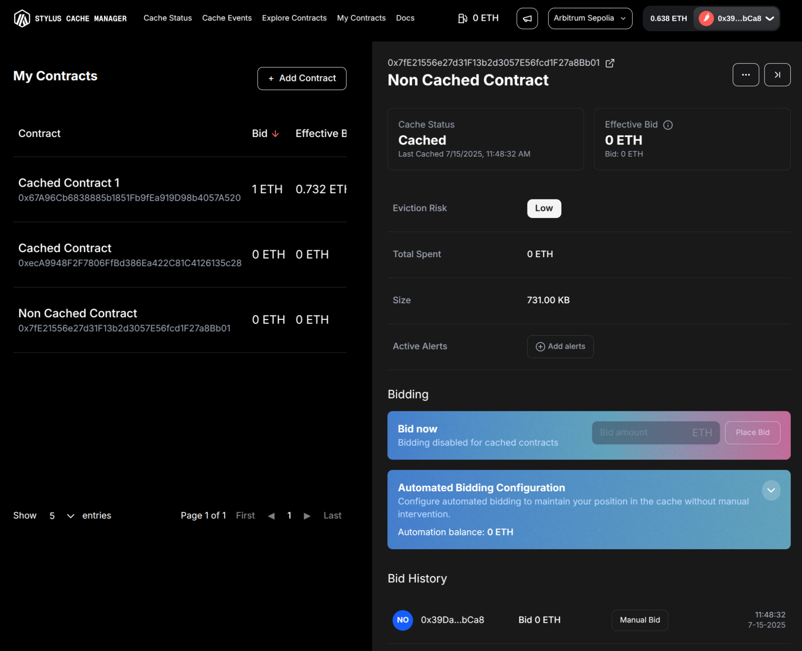

# **Tutorials**

> **Get started fast!** Here's how to use the Stylus Cache Manager UI for the most important actions—step by step, with visuals to guide you.

---

## **💰 Place a Bid**

In **My Contracts**, select the contract you want to manage.

<figure markdown="span">
  { width="600" }
</figure>

When clicking bid secion, suggestions will popup. Sometimes getting your contract cached can be free!

<figure markdown="span">
  { width="600" }
</figure>

Enter your bid amount in Bid Now section click "Place Bid" and confirm the transaction details.

<figure markdown="span">
  { width="600" }
</figure>

Wait for confirmation and the UI will update your contract's cache status.

<figure markdown="span">
  { width="600" }
</figure>

---
