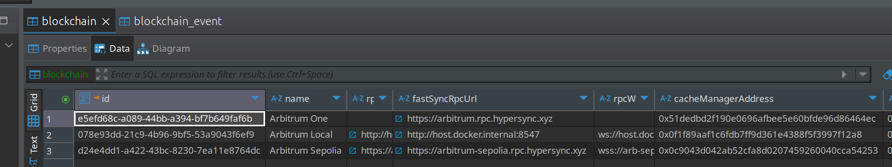
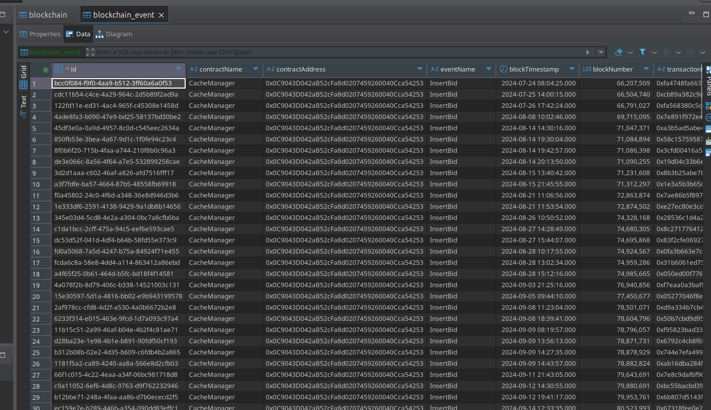

# **🔧 SCM UI Backend Deployment**

> **Deploy the Stylus Cache Manager backend API** - the core service that handles contract management, automated bidding, and real-time blockchain event processing.

---

## **🎯 What is the SCM UI Backend?**

The **SCM UI Backend** is a comprehensive API service that provides:

- **📊 Real-time Data Processing:** Syncs blockchain events and maintains cache state
- **🤖 Automation Management:** Handles automated bidding logic and ThirdWeb Engine integration
- **🔐 Authentication:** Manages user sessions and wallet authentication
- **📱 RESTful APIs:** Provides endpoints for frontend communication
- **🔔 Notification System:** Sends alerts via Telegram and other channels
- **💾 Data Persistence:** Stores contracts, bids, and user data in PostgreSQL

---

## **🔧 Prerequisites**

Before deploying the backend, ensure you have:

- **✅ Deployed CMA Contracts** from the previous step
- **✅ Configured ThirdWeb Engine** with access token and backend wallet
- **✅ Docker & Docker Compose** running
- **✅ PostgreSQL & Redis** (handled by Docker Compose)
- **🔑 ThirdWeb Access Token** from Engine configuration
- **💰 Backend Wallet Address** imported in ThirdWeb Engine

---

## **⚙️ Configuration Setup**

### **1. Environment Files**

Copy the example environment files:

```bash
cp src/docker/.env.backend.example src/docker/.env.backend
cp src/docker/.env.scm-db.example src/docker/.env.scm-db
```

!!! tip "Database Configuration"

    For local testing, the SCM database environment can remain as in the example. The Docker Compose setup handles all database initialization.

---

## **🌐 Blockchain Configuration**

### **Network Settings**

Configure blockchain connections via environment variables in `src/docker/.env.backend`:

```bash
# Arbitrum One (Production) - Disabled for testing
ARB_ONE_RPC=
ARB_ONE_RPC_WSS=
ARB_ONE_FAST_SYNC_RPC=https://arbitrum.rpc.hypersync.xyz
ARB_ONE_CMA_ADDRESS=
ARB_ONE_ENABLED=false

# Arbitrum Sepolia (Testing) - Enabled
ARB_SEPOLIA_RPC=https://sepolia-rollup.arbitrum.io/rpc
ARB_SEPOLIA_RPC_WSS=wss://sepolia-rollup.arbitrum.io/ws
ARB_SEPOLIA_FAST_SYNC_RPC=https://arbitrum-sepolia.rpc.hypersync.xyz
ARB_SEPOLIA_CMA_ADDRESS=0x1B38ABF292a39F659916A9e7074aB1C3407196A9
ARB_SEPOLIA_ENABLED=true

# Arbitrum Local (Development) - Enabled
ARB_LOCAL_RPC=http://host.docker.internal:8547
ARB_LOCAL_RPC_WSS=ws://host.docker.internal:8548
ARB_LOCAL_FAST_SYNC_RPC=http://host.docker.internal:8547
ARB_LOCAL_CMA_ADDRESS=0xA6E41fFD769491a42A6e5Ce453259b93983a22EF
ARB_LOCAL_ENABLED=true
```

!!! warning "RPC Provider Selection"

    Use an RPC provider that doesn't trigger rate limits easily. For initial sync, we use Hypersync for efficient block event reading.

!!! tip "CMA Address Configuration"

    Replace the CMA addresses with the actual deployed contract addresses from your deployment step.

---

## **🔑 ThirdWeb Engine Integration**

### **Engine Configuration**

Configure ThirdWeb Engine integration using your access token and backend wallet:

```bash
# Backend wallet address (imported in ThirdWeb Engine)
ENGINE_BACKEND_WALLET_ADDRESS=0xYourBackendWalletAddress

# Access token from ThirdWeb Engine configuration
ENGINE_AUTH_TOKEN=your_thirdweb_access_token_here
```

!!! warning "Token Security"

    Keep your access token secure. This token allows the backend to communicate with your ThirdWeb Engine instance.

---

## **🔔 Optional: Telegram Notifications**

### **Bot Configuration**

For Telegram notifications, create a bot through [@BotFather](https://t.me/botfather) and configure:

```bash
# Telegram bot token (optional)
TELEGRAM_BOT_TOKEN=your_telegram_bot_token_here
```

!!! tip "Notification Setup"

    If you don't need notifications yet, leave this empty. You can configure it later.

---

## **🌐 Nginx Configuration**

### **Switch to Local Branch**

For local testing without CORS restrictions, switch to the local branch:

```bash
cd submodules/stylus-cm-nginx
git checkout local
cd ../../
```

!!! info "CORS Configuration"

    The local branch removes CORS checks for easier local development. For production, use the main branch with proper CORS settings.

---

## **🚀 Deploy Backend Services**

### **Automated Deployment**

Use the npm script to start all backend services:

```bash
npm run backend:start
```

### **Manual Deployment**

Or deploy manually with Docker Compose:

```bash
docker compose -f src/docker/docker-compose.yaml up -d scm-db scm-redis scm-backend scm-nginx
```

### **Service Management**

Additional commands for managing backend services:

```bash
# Pause services
npm run backend:pause

# Stop and remove services
npm run backend:delete

# View logs
docker compose -f src/docker/docker-compose.yaml logs -f scm-backend
```

---

## **📊 Verification & Monitoring**

### **Initial Sync Process**

After starting the backend, you should see extensive synchronization logs:

```bash
# Monitor backend logs
docker compose -f src/docker/docker-compose.yaml logs -f scm-backend
```

**Expected Log Output:**

```
[Nest] 30  - 07/18/2025, 8:03:47 PM   DEBUG [DataProcessing - InsertBid] No contract found for 0x66a8332553D190dd6b5a0d7083a13a5C596Cb1E7, creating new entry
[Nest] 30  - 07/18/2025, 8:03:47 PM     LOG [DataProcessing - InsertBid] Successfully processed InsertBid event for bytecode 0xde65f497af6c8526dbe61b9f4798728c16d0765d53ca9ecf3a5218c529148144
[Nest] 30  - 07/18/2025, 8:03:47 PM   DEBUG [DataProcessing - EventProcessor] Successfully processed event InsertBid
[Nest] 30  - 07/18/2025, 8:03:47 PM   DEBUG [DataProcessing - EventProcessor] Processing event InsertBid for blockchain Arbitrum Sepolia
```

### **Database Verification**

Check that blockchain data is being populated:

<figure markdown="span">
  { width="500" }
</figure>

<figure markdown="span">
  { width="500" }
</figure>

!!! success "Sync Success"

    You should see all configured blockchains and extensive event data loaded into the database.

---

## **✅ Deployment Complete**

Congratulations! Your SCM UI Backend is now:

- **📊 Syncing blockchain events** in real-time
- **🤖 Connected to ThirdWeb Engine** for automation
- **🔐 Ready for frontend integration**
- **💾 Storing data** in PostgreSQL
- **🔔 Configured for notifications** (if enabled)

---

## **🔧 Next Steps**

With the backend deployed, proceed to **[SCM UI Frontend](scm-ui-frontend.md)** - Deploy the frontend web application
