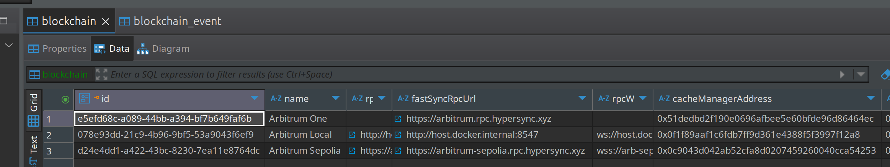
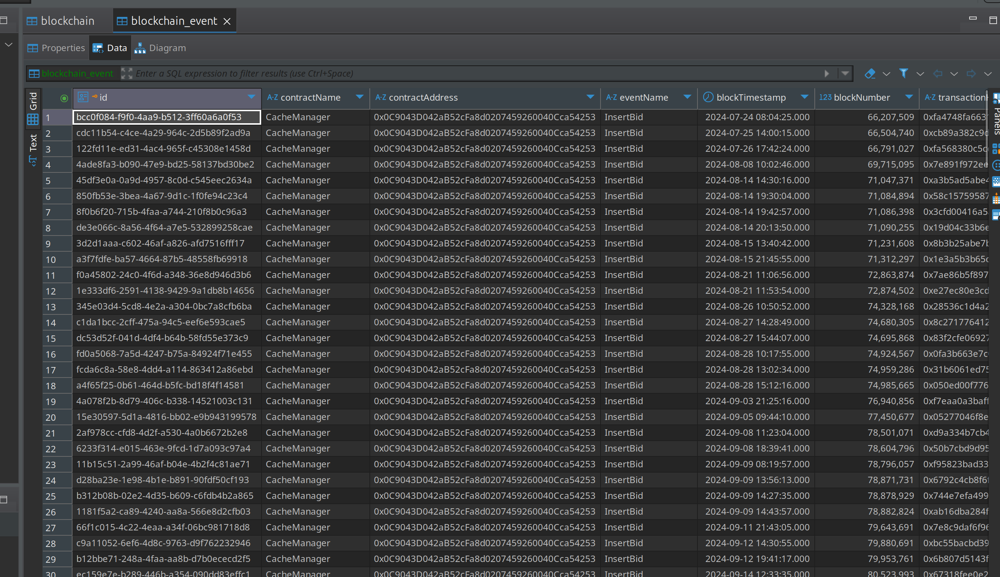

# **🔧 Stylus Manager Backend Deployment**

> **Deploy the Stylus Manager backend API** - the core service that handles contract management, activation and caching automation, and blockchain event processing.

---

## **🎯 What is the Stylus Manager Backend?**

The **Stylus Manager Backend** is a comprehensive API service that provides:

- **📊 Real-time Data Processing:** Syncs blockchain events and maintains cache state
- **🤖 Automation Management:** Handles independent bidding and reactivation workers through ThirdWeb Engine
- **🔐 Authentication:** Manages user sessions and wallet authentication
- **📱 RESTful APIs:** Provides endpoints for frontend communication
- **🔔 Notification System:** Sends alerts via Telegram and other channels
- **💾 Data Persistence:** Stores contracts, bids, and user data in PostgreSQL

---

## **🔧 Prerequisites**

Before deploying the backend, ensure you have:

- **✅ Deployed automation contracts** from the previous step
- **✅ Configured ThirdWeb Engine** with access token and backend wallet
- **✅ Docker & Docker Compose** running
- **✅ PostgreSQL & Redis** (handled by Docker Compose)
- **🔑 ThirdWeb Access Token** from Engine configuration
- **💰 Backend Wallet Address** imported in ThirdWeb Engine

---

## **⚙️ Configuration Setup**

### **1. Environment Files**

Copy the example environment files:

```bash
cp src/docker/.env.backend.example src/docker/.env.backend
cp src/docker/.env.scm-db.example src/docker/.env.scm-db
```

!!! tip "Database Configuration"

    For local testing, the Stylus Manager database environment can remain as in the example. The Docker Compose setup handles all database initialization.

---

## **🌐 Blockchain Configuration**

### **Network Settings**

Configure blockchain connections via environment variables in `src/docker/.env.backend`:

```bash
# Arbitrum One (Production) - Disabled for testing
ARB_ONE_RPC=
ARB_ONE_RPC_WSS=
ARB_ONE_FAST_SYNC_RPC=https://arbitrum.rpc.hypersync.xyz
ARB_ONE_FAST_SYNC_RPC_ACCESS_TOKEN=
ARB_ONE_CMA_ADDRESS=
ARB_ONE_ENABLED=false

# Arbitrum Sepolia (Testing) - Enable only when configured
ARB_SEPOLIA_RPC=https://sepolia-rollup.arbitrum.io/rpc
ARB_SEPOLIA_RPC_WSS=wss://sepolia-rollup.arbitrum.io/ws
ARB_SEPOLIA_FAST_SYNC_RPC=https://arbitrum-sepolia.rpc.hypersync.xyz
ARB_SEPOLIA_FAST_SYNC_RPC_ACCESS_TOKEN=
ARB_SEPOLIA_CMA_ADDRESS=0xYOUR_OPERATED_SEPOLIA_CMA_V2
ARB_SEPOLIA_ENABLED=false

# Arbitrum Local (Development) - Enabled
ARB_LOCAL_RPC=http://host.docker.internal:8547
ARB_LOCAL_RPC_WSS=ws://host.docker.internal:8548
ARB_LOCAL_FAST_SYNC_RPC=http://host.docker.internal:8547
ARB_LOCAL_CMA_ADDRESS=0xYOUR_LOCAL_CMA_V2
ARB_LOCAL_ENABLED=true
```

!!! warning "RPC Provider Selection"

    Use an RPC provider that doesn't trigger rate limits easily. For initial sync, we use Hypersync for efficient block event reading.

!!! tip "CMA Address Configuration"

    Replace the CMA addresses with the actual deployed contract addresses from your deployment step.

---

## **🔑 ThirdWeb Engine Integration**

### **Engine Configuration**

Configure ThirdWeb Engine integration using your access token and backend wallet:

```bash
# Backend wallet address (imported in ThirdWeb Engine)
ENGINE_BACKEND_WALLET_ADDRESS=0xYourBackendWalletAddress

# Access token from ThirdWeb Engine configuration
ENGINE_AUTH_TOKEN=your_thirdweb_access_token_here
```

!!! warning "Token Security"

    Keep your access token secure. This token allows the backend to communicate with your ThirdWeb Engine instance.

---

## **🔔 Optional: Telegram Notifications**

### **Bot Configuration**

For Telegram notifications, create a bot through [@BotFather](https://t.me/botfather) and configure:

```bash
# Telegram bot token (optional)
TELEGRAM_BOT_TOKEN=your_telegram_bot_token_here
```

!!! tip "Notification Setup"

    If you don't need notifications yet, leave this empty. You can configure it later.

---

## **⚙️ Activation and Caching Workers**

Configure each worker independently in `src/docker/.env.backend`:

```dotenv
CMA_AUTOMATION_ENABLED=true
CMA_ACTIVATION_AUTOMATION_ENABLED=true
```

Set either flag to `false` to stop that backend worker. These flags do not rewrite users' on-chain settings. If omitted, caching defaults to `true` and activation to `false`.

Use one automation deployment per chain/CMA pair, with an Engine wallet funded for transaction gas. User Gas Tank funds pay bid and activation value. Supply the optional `ARB_*_FAST_SYNC_RPC_ACCESS_TOKEN` when the fast-sync provider requires authentication. Never put these tokens in frontend variables.

## **💾 Database Migrations in v2**

| `ENVIRONMENT` | Schema behavior |
| --- | --- |
| `local`, `develop` | TypeORM synchronizes entities at startup. Use a disposable development database. |
| `staging`, `production` | Pending migrations run at startup; synchronization is disabled. |

This release adds migrations for `Contract.biddingEnabled`, activation columns, and the four activation alert types. `POSTGRES_DB_SYNC` is not read by this backend.

From the backend directory, with its database environment configured:

```bash
npm run migration:show
npm run migration:run
```

For an existing installation, verify the schema and take a database backup before upgrading. A previously synchronized database may already contain the columns; baseline only the migrations whose changes are present, using the procedure in the [backend migration guide](https://github.com/CoBuilders-xyz/stylus-cm-backend/tree/deb412c#database-migrations). Do not mark missing schema changes as applied.

Startup migration assumes a single application instance. Before scaling to multiple replicas, move migration to a coordinated pre-deploy step or add a database lock.

## **🌐 Local Access and Nginx**

Keep the Nginx submodule on `main`. Its checked-in configuration targets Railway's private backend hostname and the public app origin; it is not the local Compose proxy configuration.

For this local guide, access the backend directly at `http://localhost:3000` and set the frontend's `NEXT_PUBLIC_API_URL` to that address. `ENVIRONMENT=local` permits local browser origins. For production, configure `FRONTEND_URL` and your reverse proxy's upstream/origin rules for the actual deployment.

---

## **🚀 Deploy Backend Services**

### **Local Deployment**

Start the local backend and its dependencies:

```bash
docker compose -f src/docker/docker-compose.yaml up -d scm-db scm-redis scm-backend
```

The Compose dependency graph also starts ThirdWeb Engine. Configure its environment first. The root `npm run backend:start` additionally starts Nginx; use it only after adapting the proxy configuration to your environment.

### **Service Management**

Additional commands for managing backend services:

```bash
# Pause services
npm run backend:pause

# Stop and remove services
npm run backend:delete

# View logs
docker compose -f src/docker/docker-compose.yaml logs -f scm-backend
```

---

## **📊 Verification & Monitoring**

### **Initial Sync Process**

After starting the backend, you should see extensive synchronization logs:

```bash
# Monitor backend logs
docker compose -f src/docker/docker-compose.yaml logs -f scm-backend
```

**Example of historical sync logs:**

```
[Nest] 30  - 07/18/2025, 8:03:47 PM   DEBUG [DataProcessing - InsertBid] No contract found for 0x66a8332553D190dd6b5a0d7083a13a5C596Cb1E7, creating new entry
[Nest] 30  - 07/18/2025, 8:03:47 PM     LOG [DataProcessing - InsertBid] Successfully processed InsertBid event for bytecode 0xde65f497af6c8526dbe61b9f4798728c16d0765d53ca9ecf3a5218c529148144
[Nest] 30  - 07/18/2025, 8:03:47 PM   DEBUG [DataProcessing - EventProcessor] Successfully processed event InsertBid
[Nest] 30  - 07/18/2025, 8:03:47 PM   DEBUG [DataProcessing - EventProcessor] Processing event InsertBid for blockchain Arbitrum Sepolia
```

### **Database Verification**

Check that blockchain data is being populated. These retained database snapshots predate the activation columns; verify the current schema and migration status as well:

<figure markdown="span">
  { width="500" }
</figure>

<figure markdown="span">
  { width="500" }
</figure>

!!! success "Sync Success"

    Verify enabled blockchains, CMA v2 addresses, indexed events, and activation state. Then open `/api` and confirm that list/detail responses include `programTimeLeft` and `programTimeLeftReason`.

---

## **✅ Deployment Complete**

Congratulations! Your Stylus Manager Backend is now:

- **📊 Syncing blockchain events** in real-time
- **🤖 Connected to ThirdWeb Engine** for automation
- **🔐 Ready for frontend integration**
- **💾 Storing data** in PostgreSQL
- **🔔 Configured for notifications** (if enabled)

---

## **🔧 Next Steps**

With the backend deployed, proceed to **[Stylus Manager Frontend](scm-ui-frontend.md)** - Deploy the frontend web application
