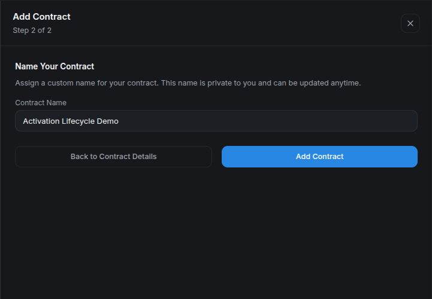
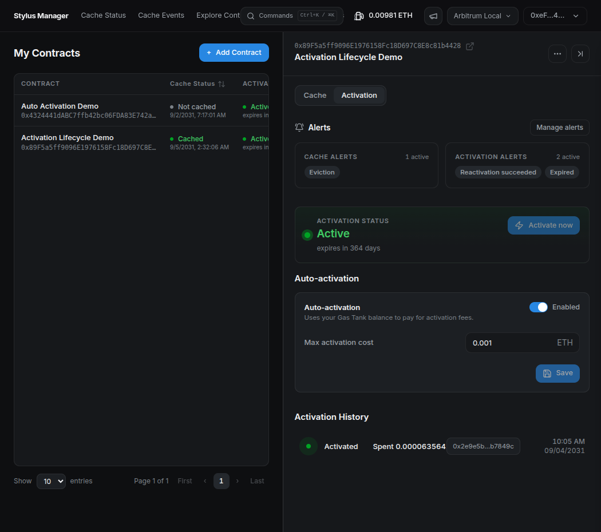
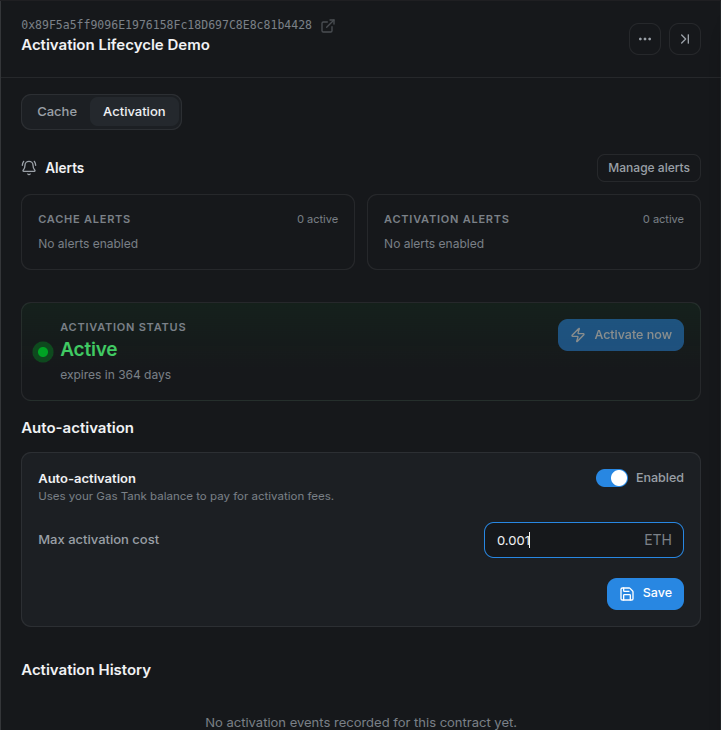
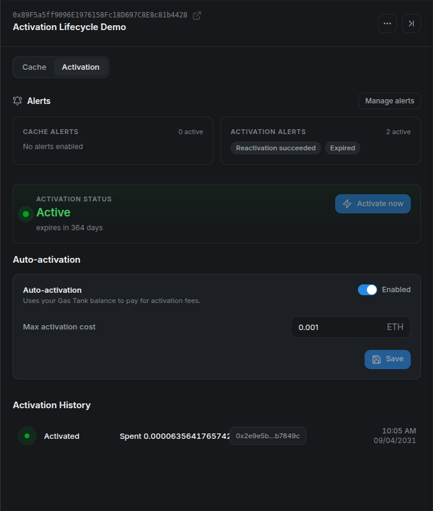
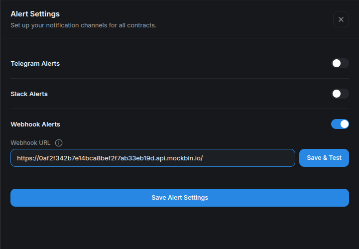
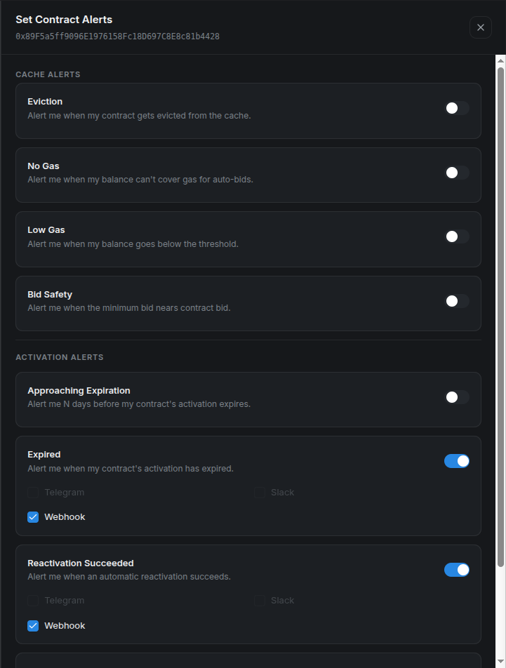
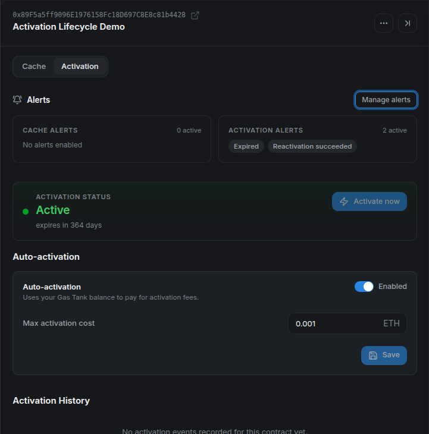
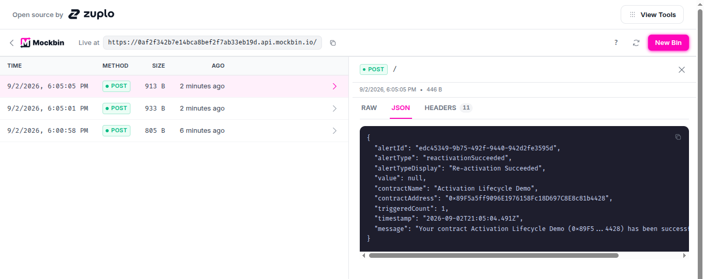

# Activating Stylus Contracts with Cargo, Hardhat, and Stylus Manager

Deploying a Stylus contract stores its compressed WebAssembly program on-chain, but deployment alone does not make that program executable. Stylus has a second lifecycle transaction called activation.

Activation asks the ArbWasm precompile to validate, instrument, and register a deployed program for the chain's current Stylus version. Until that succeeds, calls to the program cannot execute normally.

This guide explains activation and demonstrates three interfaces on Arbitrum Sepolia:

1. Cargo for the standard developer workflow.
2. Hardhat for a direct call to the ArbWasm precompile.
3. Stylus Manager for manual activation, experimental automation, and alerts.

## Deployment and activation are different transactions

A Stylus program moves through two distinct steps:

1. **Deployment** stores processed, compressed WASM at an address.
2. **Activation** registers that program through ArbWasm and makes it executable.

Activation processes the program for a specific Stylus protocol version and charges a data fee based on the work and data involved. The caller supplies ETH to the precompile. Excess value is refundable, but applications should still estimate the fee and make their maximum spend visible.

Activation is associated with program code. Multiple deployments with the same codehash can share an activation, and the account that activates a program does not have to be its deployer or owner.

Activation is also not necessarily permanent. A program can require reactivation after its configured lifetime expires or after a protocol upgrade makes the previous activation version obsolete. Lifetime and keepalive parameters are controlled by each chain; current defaults should never be presented as universal constants.

The canonical protocol overview is Arbitrum's [activation documentation](https://docs.arbitrum.io/stylus/concepts/activation).

## Before you start

Before running the methods, complete the [prerequisites and demo setup](#appendix-prerequisites-and-demo-setup) in the appendix. The Cargo, Hardhat, and Stylus Manager sections are alternative ways to activate a program.

!!! info "Repository files used by this tutorial"
    The commands assume a local checkout of the [Stylus Cache Manager repository](https://github.com/cobuilders-xyz/stylus-cm-deploy). Runnable files live under [`examples/`](https://github.com/cobuilders-xyz/stylus-cm-deploy/tree/main/examples), outside the MkDocs source tree.

Each method needs a distinct program codehash deployed with `--no-activate`. Use the generated `cargo`, `hardhat`, and `platform` projects for their matching sections.

The command examples use the disposable testnet key configured in the appendix:

```bash
export KEY_PATH="$STYLUS_EXAMPLES_ROOT/disposable-private-key.txt"
```

## Method 1: activate with Cargo

The usual Cargo deployment flow activates automatically. These tutorial commands use `--no-verify` so they build locally instead of requiring Docker for a reproducible deployment:

```bash
cargo stylus deploy --no-verify \
  --private-key-path "$KEY_PATH" \
  --endpoint "$ARB_SEPOLIA_RPC" \
  --max-fee-per-gas-gwei "$MAX_FEE_PER_GAS_GWEI"
```

Cargo deploys the program, estimates its activation data fee, and activates it unless told otherwise. That command is shown for context; do not run it for this comparison because we want to observe activation separately.

Enter the unique Cargo project created in the appendix, then deploy without activation:

```bash
cd "$CARGO_PROGRAM_DIR"

cargo stylus deploy --no-activate --no-verify \
  --private-key-path "$KEY_PATH" \
  --endpoint "$ARB_SEPOLIA_RPC" \
  --max-fee-per-gas-gwei "$MAX_FEE_PER_GAS_GWEI"
```

Copy the deployed program address from the output:

```bash
export STYLUS_PROGRAM="0xYOUR_UNACTIVATED_STYLUS_PROGRAM"
```

Confirm that the program is not active yet by reading `programTimeLeft` directly from ArbWasm:

```bash
export ARB_WASM="0x0000000000000000000000000000000000000071"

cast call "$ARB_WASM" \
  "programTimeLeft(address)(uint64)" \
  "$STYLUS_PROGRAM" \
  --rpc-url "$ARB_SEPOLIA_RPC"
```

The expected result is an execution revert indicating that the program is not activated. This is the on-chain confirmation; Cargo's recommendation to activate after deployment is only informational.

Then activate it explicitly:

```bash
cargo stylus activate \
  --address "$STYLUS_PROGRAM" \
  --private-key-path "$KEY_PATH" \
  --endpoint "$ARB_SEPOLIA_RPC" \
  --max-fee-per-gas-gwei "$MAX_FEE_PER_GAS_GWEI"
```

Cargo estimates the data fee without sending the estimation as a transaction and applies its configured safety bump before activation. The command reports the transaction and activation result.

Run the same state check again:

```bash
cast call "$ARB_WASM" \
  "programTimeLeft(address)(uint64)" \
  "$STYLUS_PROGRAM" \
  --rpc-url "$ARB_SEPOLIA_RPC"
```

This time the call should return a positive number of seconds, confirming that the program is active.

### Common Cargo failures

- **Already active or program up to date:** no activation is required for this codehash and protocol version.
- **Program not found:** verify the address and Sepolia endpoint.
- **Invalid WASM:** run `cargo stylus check` and resolve validation errors before deployment.
- **Insufficient value:** fund the signer or review fee-estimation options such as the data-fee bump.
- **Max fee below the block base fee:** increase `MAX_FEE_PER_GAS_GWEI` and retry. The `0.2` value in the appendix was verified on Sepolia for this tutorial, but it is not a protocol constant.
- **Docker unavailable during deployment:** keep `--no-verify` for the tutorial's local build, or configure Docker if you specifically need reproducible deployment verification.
- **Needs upgrade:** reactivate the program against the current protocol version.

The exact flags can evolve, so compare examples with `cargo stylus activate --help` and the current [`cargo-stylus` command reference](https://docs.arbitrum.io/stylus/cli-tools/commands-reference).

## Method 2: call ArbWasm from Hardhat

First deploy the separate Hardhat demo program without activating it:

```bash
cd "$HARDHAT_PROGRAM_DIR"

cargo stylus deploy --no-activate --no-verify \
  --private-key-path "$KEY_PATH" \
  --endpoint "$ARB_SEPOLIA_RPC" \
  --max-fee-per-gas-gwei "$MAX_FEE_PER_GAS_GWEI"
```

Copy the address printed by Cargo, then replace the placeholder:

```bash
export HARDHAT_PROGRAM_ADDRESS="0xTHE_HARDHAT_PROGRAM_ADDRESS"
```

Put this address in the standalone example's `.env` as `STYLUS_CONTRACT_ADDRESS`. It must be different from the address activated in the Cargo section:

```bash
sed -i \
  "s/^STYLUS_CONTRACT_ADDRESS=.*/STYLUS_CONTRACT_ADDRESS=$HARDHAT_PROGRAM_ADDRESS/" \
  "$STYLUS_EXAMPLES_ROOT/hardhat/.env"
```

Activation is a payable call to the ArbWasm precompile at:

```text
0x0000000000000000000000000000000000000071
```

The two functions needed by this example are:

```solidity
function programTimeLeft(address program) external view returns (uint64);

function activateProgram(address program)
    external
    payable
    returns (uint16 version, uint256 dataFee);
```

The runnable example is an ESM-based Hardhat 3 project in [`examples/hardhat`](https://github.com/cobuilders-xyz/stylus-cm-deploy/tree/main/examples/hardhat). Configure `.env`, then execute:

```bash
cd "$STYLUS_EXAMPLES_ROOT/hardhat"
npm ci
npm run check
npm run activate -- --network arbitrumSepolia
```

Hardhat 3 plugins are loaded for an explicit network connection. The essential ethers v6 flow is:

```typescript
import { network } from "hardhat";

const { ethers } = await network.create();
const feeCeiling = ethers.parseEther("0.01");

const [version, dataFee] = await arbWasm.activateProgram.staticCall(
  programAddress,
  { value: feeCeiling },
);

const tx = await arbWasm.activateProgram(programAddress, {
  value: dataFee,
});
await tx.wait();

const secondsLeft = await arbWasm.programTimeLeft(programAddress);
```

The static call does not activate the contract. It simulates activation with a configurable ceiling so the precompile can return the required fee. The real transaction then uses the quoted amount. If the ceiling is too low, the simulation fails before the wallet spends gas, and the operator can choose whether to approve a higher maximum.

The complete [`activate.ts` script](https://github.com/cobuilders-xyz/stylus-cm-deploy/blob/main/examples/hardhat/scripts/activate.ts) also checks chain ID, validates that bytecode exists, exits if the program is already active, and verifies `programTimeLeft` after confirmation.

Direct integrations should decode known ArbWasm errors and present them as lifecycle states rather than generic failures. In particular, “not activated,” “expired,” “needs upgrade,” and “already up to date” require different operator responses.

## Method 3: activate with Stylus Manager

Stylus Manager detects activation state while adding or inspecting a contract.

Before opening the platform, deploy the third unique program without activation:

```bash
cd "$PLATFORM_PROGRAM_DIR"

cargo stylus deploy --no-activate --no-verify \
  --private-key-path "$KEY_PATH" \
  --endpoint "$ARB_SEPOLIA_RPC" \
  --max-fee-per-gas-gwei "$MAX_FEE_PER_GAS_GWEI"
```

Copy the address printed by Cargo, then replace the placeholder:

```bash
export PLATFORM_PROGRAM_ADDRESS="0xTHE_PLATFORM_PROGRAM_ADDRESS"
```

Set `PLATFORM_PROGRAM_ADDRESS` to the new address printed by Cargo. It must not be either of the addresses used for Cargo or Hardhat.

For a newly deployed, inactive program:

1. Open Stylus Manager and select **Arbitrum Sepolia**.
2. Connect a funded test wallet.
3. Go to **My Contracts** and select **Add Contract**.
4. Enter `PLATFORM_PROGRAM_ADDRESS`.
5. When the validation step reports that activation is required, select **Activate Now**.
6. Review the network and amount in the wallet, then confirm.
7. After confirmation, optionally name the contract and finish adding it.

The screenshots use the repository's local Arbitrum devnode because its clock can be advanced, allowing us to show activation, expiration, and reactivation without waiting for the full activation lifetime. The platform flow is the same on Sepolia. Every contract-specific screenshot below uses the same disposable program: `0x89F5a5ff9096E1976158Fc18D697C8E8c81b4428`.

The platform validates the program address and reports that activation is required, including an estimated activation fee:


*Review the address and estimated fee before selecting **Activate now**.*

After the wallet transaction is confirmed, the same validation step reports a valid program and a positive remaining lifetime:


*A positive lifetime is the on-chain confirmation that activation succeeded.*

Once the activation receipt is confirmed, name the program and add it to the dashboard:



*The display name is private platform metadata and can be changed later.*

For a previously managed program that expired or needs an upgrade, reactivate it from its contract details:

1. Open **My Contracts**, select the program, and switch to its **Activation** tab.
2. Verify the full address and confirm that **Activation status** is **Inactive** with the reason **Activation expired**.
3. Select **Activate now**.


*When the program requires activation, its status changes to **Inactive** and the **Activate now** action becomes available.*

The platform estimates the activation fee and prepares the transaction. Review the request in your wallet before confirming it.

4. Confirm the transaction in the wallet.
5. Once it is confirmed, return to the **Activation** tab.
6. Verify that the status is **Active** and that the renewed lifetime is displayed.



*The program is active again, and the renewed lifetime confirms that the manual reactivation is complete.*

## Method 4: automate reactivation — experimental

Stylus Manager's experimental auto-activation is intended to reactivate a registered program after it expires or when a protocol upgrade requires a new activation. It is not preventive keepalive and should not be described as guaranteeing uninterrupted availability.

Open **Gas Tank** and deposit Sepolia ETH. This per-user escrow is shared with automated caching, so the available balance must cover both features if both are enabled.


*Enter a deposit amount, acknowledge the experimental-feature warning, and select **Deposit Gas**. The wallet must confirm this deposit. Wait for the confirmed balance before enabling automation.*

Then open the contract's **Activation** tab:

1. Enable auto-activation.
2. Enter the maximum activation cost the system may reserve for one attempt.
3. Save and confirm the on-chain configuration.
4. Verify the enabled state, maximum, and Gas Tank balance.


*Confirm that the program is active and that the automation control belongs to the expected address.*



*The maximum is a per-attempt ceiling, not an estimate or a guaranteed charge.*

The backend periodically selects eligible programs and submits a batch to the automation contract. Before spending, the on-chain contract verifies the registration, auto-activation flag, maximum cost, escrow balance, and actual activation state. It withdraws up to the configured maximum, calls ArbWasm, and returns unused value to the Gas Tank. Failed activation attempts are refunded and recorded for retries and alerts.

There can be a delay between expiry and a successful automated transaction because selection is periodic and retries use backoff. Applications that require uninterrupted service need an independent lifecycle and keepalive strategy rather than relying on this experimental feature alone.

To demonstrate the complete flow, the local devnode clock was advanced until the program expired. This is only a shortcut for the walkthrough; from that point onward, the platform handles the same expiration state it would encounter on Sepolia.

When the automation detects the expired program, the operator submits the activation transaction and pays the fee from the user's Gas Tank. No additional wallet confirmation is required. After the successful cycle, refresh the contract and verify that the program is active again, the Gas Tank reflects the activation cost, and **Activation History** contains an **Activated** event.



*This local run charged about 0.0000636 ETH and recorded the automated activation transaction.*

## Set up activation alerts

Configure delivery destinations from **Alert Settings** in the platform header. Available channels are Telegram, Slack incoming webhooks, and custom webhooks. Use a test-only destination first and run **Test** or **Save & Test**.

For this walkthrough, create a free request bin in Mockbin and paste its generated endpoint into **Webhook URL**:



*Use **Save & Test** to validate the destination before depending on lifecycle alerts.*

Then open the contract's actions menu and select **Contract Alerts**. Activation-related options include:

- **Approaching expiration**, with a configurable number of days;
- **Expired**;
- **Reactivation succeeded**; and
- **Reactivation failed**.

Select one or more configured channels and save. Keep webhook URLs private: anyone who obtains an incoming webhook may be able to send messages into that destination.

For the local lifecycle run, enable only **Expired** and **Reactivation Succeeded**, with **Webhook** selected for both:



*The address at the top confirms that these alerts belong to the same program used throughout the platform walkthrough.*

After saving, the contract detail summarizes the two active activation alerts next to the enabled automation configuration:



Approaching-expiration and expired conditions are checked periodically. Success and failure can also be driven by automation events. Notification cooldowns prevent repeated identical alerts from becoming noise, so use the channel test for immediate delivery verification.

### What the webhook notifications look like

When the local clock passes the configured lifetime, Mockbin receives the `expired` payload. It identifies the alert type, display name, full contract address, timestamp, and human-readable message:


*The expiration notification arrived before the automation transaction completed.*

After the worker reactivates the same program, the event-driven success alert arrives as a second request:



*The two webhook timestamps are four seconds apart in this local run, but production timing depends on scheduling, confirmation, and retry backoff.*

## An activation runbook

Use this lifecycle checklist for every Stylus release:

1. Run `cargo stylus check` against the exact build artifact.
2. Decide whether deployment should activate immediately or intentionally use `--no-activate`.
3. Estimate the activation cost and set an explicit maximum.
4. Wait for confirmation and verify `programTimeLeft`.
5. Configure expiration and failure alerts.
6. Monitor protocol upgrades and the program's remaining lifetime.
7. Treat automation as a guarded fallback until it has passed your own operational review.

Cargo is the standard development path. Hardhat exposes the precise ArbWasm call for integrations. Stylus Manager combines manual activation, lifecycle visibility, experimental reactivation, shared funding, and alerts. Whichever interface you use, activation is an on-chain state transition that should always be verified after confirmation.

## Appendix: prerequisites and demo setup

Complete this appendix before running any of the activation methods. It prepares the tools, network, disposable wallet, and three unique programs used only by this tutorial.

### Tools and versions

| Requirement | Version to use | Used for |
| --- | --- | --- |
| Rust and `rustup` | Current stable `rustup`; the Rust compiler version is selected by the generated project. | Building the Stylus programs. |
| Project Rust toolchain | The exact toolchain and WASM target declared in each generated project's `rust-toolchain.toml`. | Building with the compiler expected by the template. |
| `cargo-stylus` | `0.10.9`, the version used to verify this tutorial. | Creating, checking, deploying, and activating Stylus programs. |
| Node.js and npm | Node.js `22.13` or newer and npm `10` or newer. | Running the standalone Hardhat `3.15.0` project. |
| Git | Any maintained Git 2.x release. | Resolving the repository root. |
| Foundry's `cast` | A current stable Foundry release. | Validating the configured wallet and checking its balance. |
| `openssl` | OpenSSL `1.1.1` or any `3.x` release. | Generating unique program identifiers. |
| GNU `sed` | GNU sed `4.x`. | Adding each identifier to its program. |
| Browser wallet | A current release with Arbitrum Sepolia support. | Using Stylus Manager. |
| Arbitrum Sepolia RPC and ETH | Not versioned. | Sending the tutorial transactions. |

Use the official installation documentation for each tool. Confirm the installed versions:

```bash
rustc --version
rustup --version
cargo stylus --version
node --version
npm --version
git --version
cast --version
openssl version
sed --version | head -n 1
```

The generated Rust toolchain is installed and selected automatically by `rustup` when Cargo runs inside a generated project.

### Clone the repository

Clone the repository with its submodules so the runnable examples and local-devnode scripts are available:

```bash
git clone --recurse-submodules \
  https://github.com/cobuilders-xyz/stylus-cm-deploy.git
cd stylus-cm-deploy
```

### Set the network values

All commands use Arbitrum Sepolia:

```bash
export ARB_SEPOLIA_RPC="https://sepolia-rollup.arbitrum.io/rpc"
export ARB_SEPOLIA_CHAIN_ID="421614"
export MAX_FEE_PER_GAS_GWEI="0.2"
export STYLUS_REPO_ROOT="$(git rev-parse --show-toplevel)"
export STYLUS_EXAMPLES_ROOT="$STYLUS_REPO_ROOT/examples"
```

`MAX_FEE_PER_GAS_GWEI` is an explicit transaction ceiling, not the expected gas price. The value `0.2` worked during this Sepolia verification; raise it if the current block base fee exceeds it.

The public RPC is sufficient for the tutorial but can be slow or rate limited. Use your own Arbitrum Sepolia endpoint if requests stall.

### Configure a funded disposable wallet

Copy the tutorial environment template from [`examples/.env.example`](https://github.com/cobuilders-xyz/stylus-cm-deploy/blob/main/examples/.env.example):

```bash
test -f "$STYLUS_EXAMPLES_ROOT/.env" ||
  cp "$STYLUS_EXAMPLES_ROOT/.env.example" "$STYLUS_EXAMPLES_ROOT/.env"
```

Open `examples/.env` and paste a disposable wallet that already has Arbitrum Sepolia ETH:

```dotenv
STYLUS_WALLET_ADDRESS=0xYOUR_DISPOSABLE_WALLET_ADDRESS
PRIVATE_KEY=0xYOUR_DISPOSABLE_PRIVATE_KEY
```

Run [`examples/setup-wallet.sh`](https://github.com/cobuilders-xyz/stylus-cm-deploy/blob/main/examples/setup-wallet.sh) in the current shell:

```bash
source "$STYLUS_EXAMPLES_ROOT/setup-wallet.sh"
```

The script verifies that the key belongs to the address, writes the Cargo key file, updates the Hardhat `.env`, exports `STYLUS_WALLET_ADDRESS` and `KEY_PATH`, and prints the Sepolia balance.

### Create three unique programs

Activation is associated with program code. The helper creates one program for each method under `examples/generated-programs`. A random `build_id` makes every directory and codehash unique; invoking it again creates three more programs without removing the existing ones.

```bash
create_unique_stylus_program() {
  local label="$1" build_id project

  build_id="$(openssl rand -hex 8)" || return 1
  project="$STYLUS_TUTORIAL_WORKSPACE/stylus-${label}-${build_id}"

  cargo stylus new "$project" >&2 || return 1
  sed -i "/impl Counter {/a\\
    pub fn build_id(&self) -> U256 { U256::from(0x${build_id}u64) }" \
    "$project/src/lib.rs" || return 1

  (
    cd "$project" || exit 1
    cargo stylus build >&2
  ) || return 1

  printf '%s\n' "$project"
}

create_stylus_demo_programs() {
  local repo_root

  repo_root="$(git rev-parse --show-toplevel)" || return 1
  export STYLUS_EXAMPLES_ROOT="$repo_root/examples"
  export STYLUS_TUTORIAL_WORKSPACE="$STYLUS_EXAMPLES_ROOT/generated-programs"
  mkdir -p "$STYLUS_TUTORIAL_WORKSPACE" || return 1

  CARGO_PROGRAM_DIR="$(create_unique_stylus_program cargo)" || return 1
  HARDHAT_PROGRAM_DIR="$(create_unique_stylus_program hardhat)" || return 1
  PLATFORM_PROGRAM_DIR="$(create_unique_stylus_program platform)" || return 1
  export CARGO_PROGRAM_DIR HARDHAT_PROGRAM_DIR PLATFORM_PROGRAM_DIR

  printf '%s\n' \
    "$CARGO_PROGRAM_DIR" \
    "$HARDHAT_PROGRAM_DIR" \
    "$PLATFORM_PROGRAM_DIR"
}

create_stylus_demo_programs
```

Validate the three projects against Arbitrum Sepolia:

```bash
for project in \
  "$CARGO_PROGRAM_DIR" \
  "$HARDHAT_PROGRAM_DIR" \
  "$PLATFORM_PROGRAM_DIR"
do
  (
    cd "$project" || exit 1
    cargo stylus build
    cargo stylus check --endpoint "$ARB_SEPOLIA_RPC"
  )
done
```

The three programs are now built and validated but not deployed. Each activation method deploys its matching program with `--no-activate` immediately before demonstrating activation.
