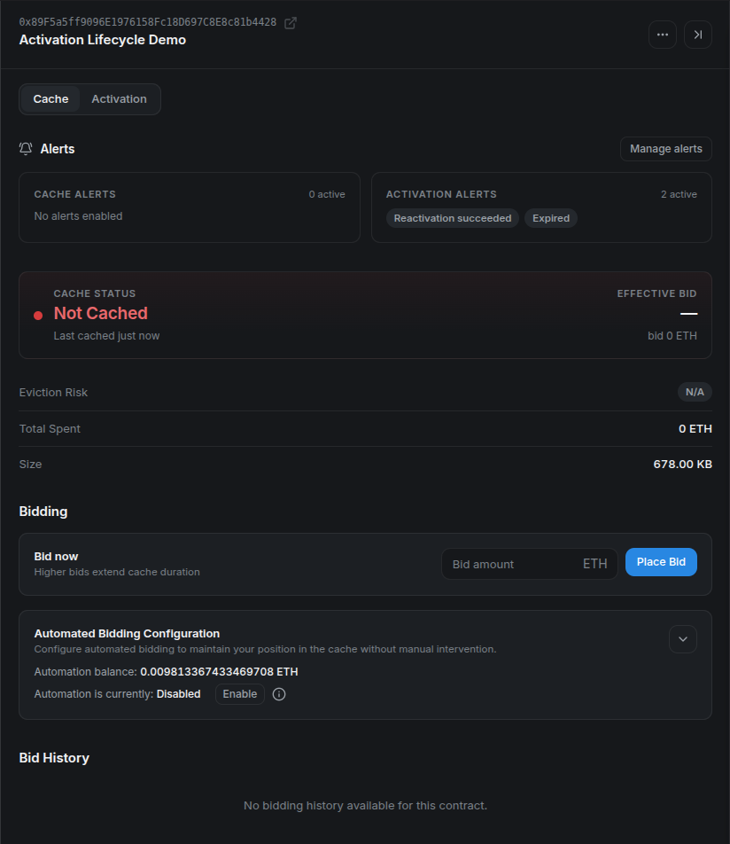
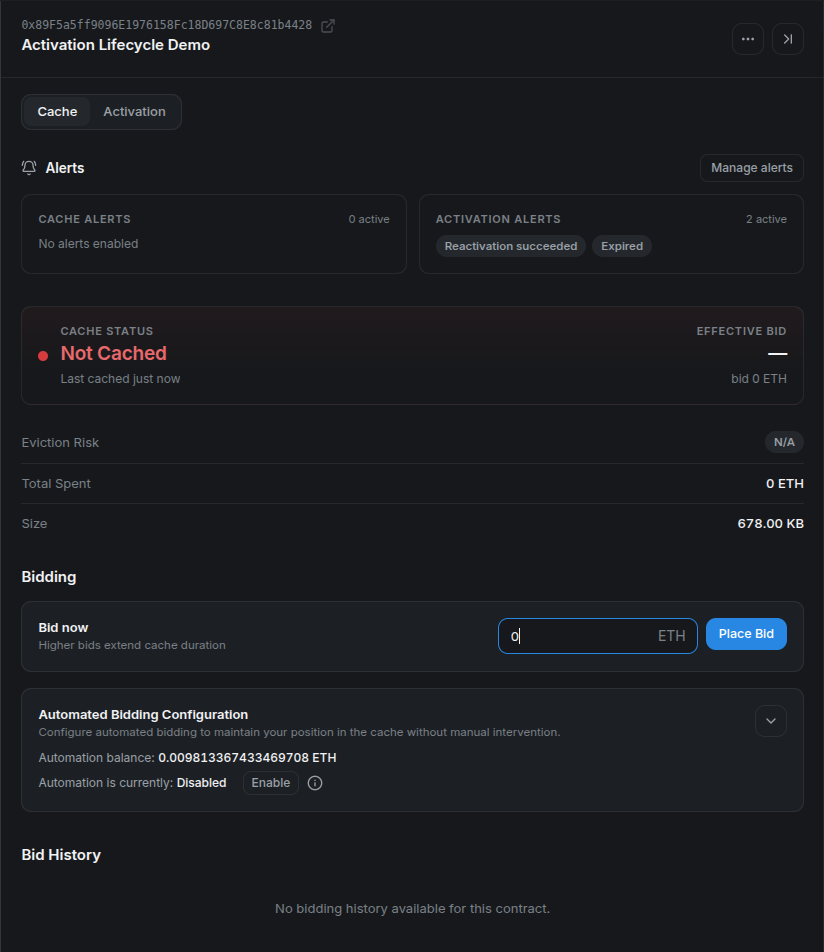
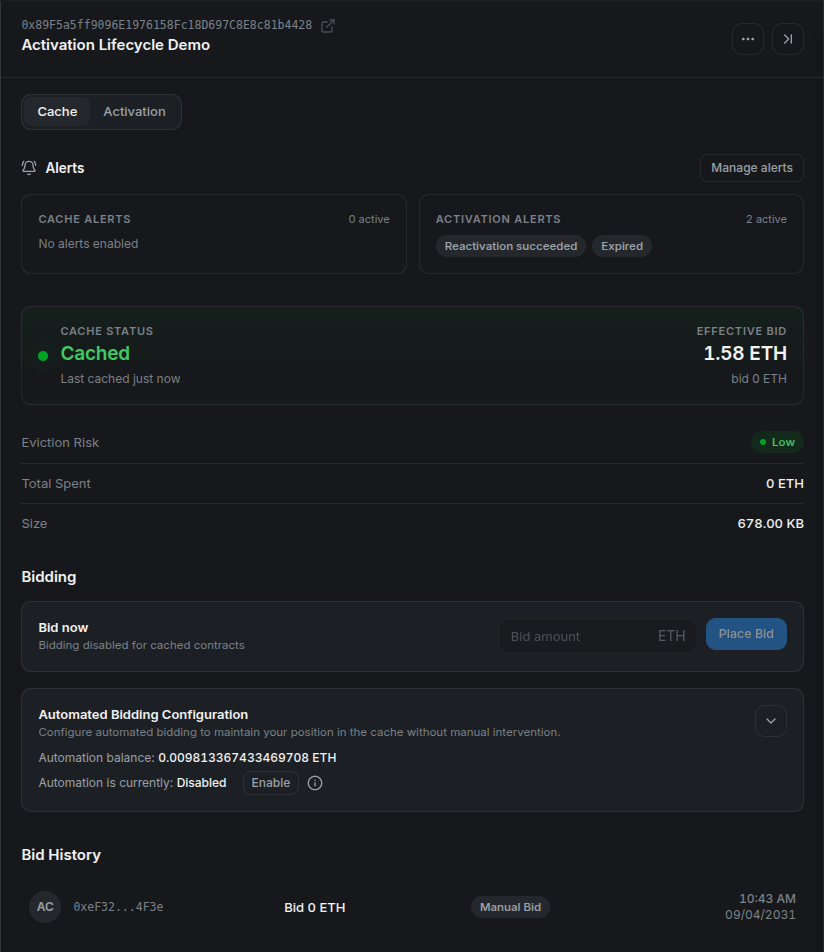
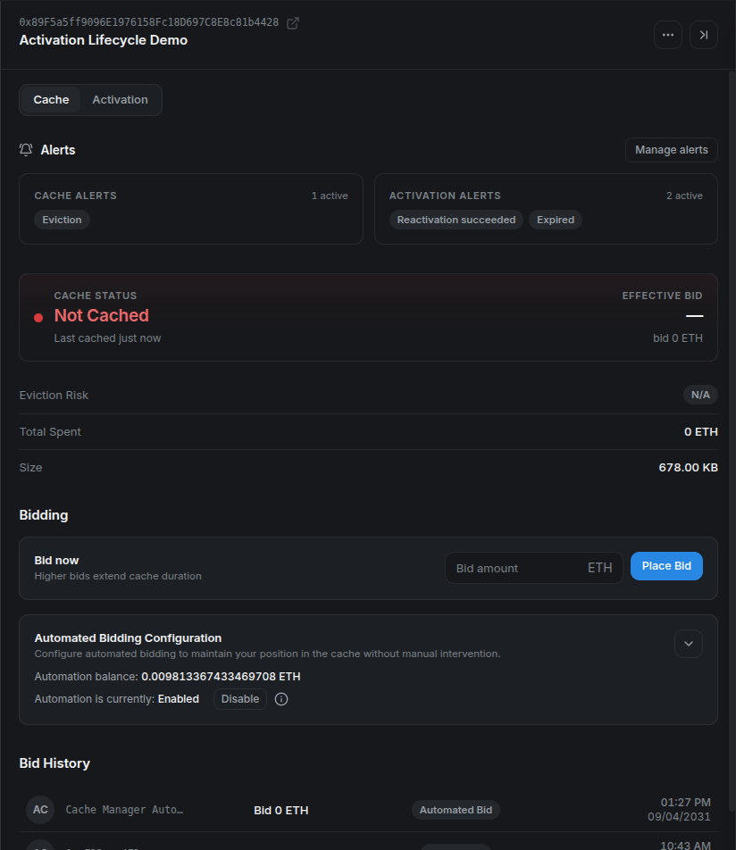
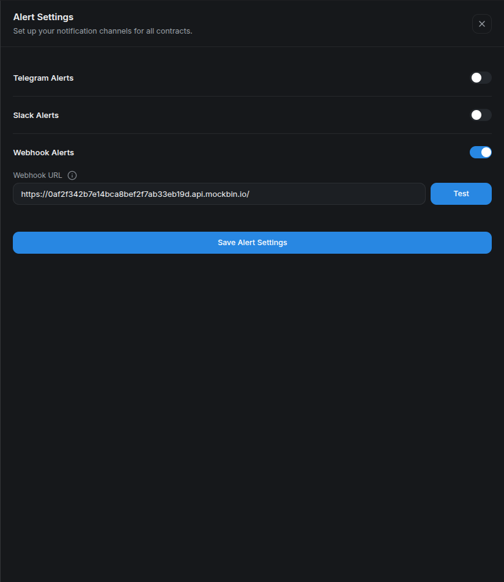
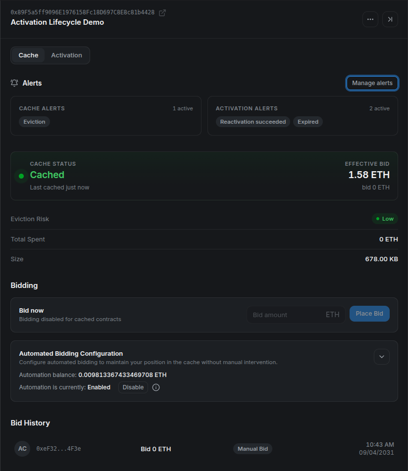
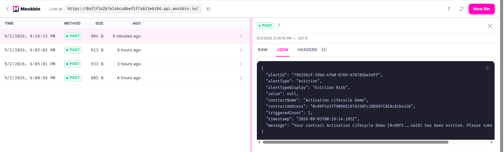

# Caching Stylus Contracts with Cargo, Hardhat, and Stylus Manager

Stylus lets developers write smart contracts in languages such as Rust and compile them to WebAssembly. Before a Stylus program can handle a call, the runtime must prepare its executable form. That initialization is more expensive when the program has to be loaded from persistent state every time.

The Stylus cache keeps selected programs in memory. A cached program avoids much of that repeated initialization work, which reduces the gas charged when users call it. Caching does not change the contract's logic, storage, address, or permissions. It changes how efficiently the runtime can enter the program.

This guide covers four ways to manage caching on Arbitrum Sepolia:

1. Inspect and cache a program with Cargo.
2. call the CacheManager directly from Hardhat.
3. place a bid through Stylus Manager.
4. configure experimental automated bidding and alerts.

## How the cache and CacheManager work

The cache has finite capacity, so it is managed as an on-chain auction. The chain's `CacheManager` accepts bids to insert activated Stylus programs into the cache. When capacity is constrained, entries with less competitive bids can be evicted to make room for stronger bids.

Three details are especially important:

- **Entries are keyed by codehash.** Contracts with identical deployed program code share the same cache state. The address you submit tells the CacheManager which program code to inspect.
- **The minimum bid is dynamic.** It depends on program size, current cache occupancy, existing bids, and the auction's decay calculation. Read it immediately before bidding.
- **Normal contract calls do not cache a program.** Someone must explicitly call the CacheManager. If a cached entry is later evicted, normal calls continue to work but become more expensive.

The `ArbWasmCache` precompile at `0x0000000000000000000000000000000000000072` tracks cache managers and cache membership. Chains may replace their CacheManager, so reusable integrations should discover the currently registered manager instead of embedding an address.

For the protocol-level implementation and auction details, see Arbitrum's [caching documentation](https://docs.arbitrum.io/stylus/how-tos/caching-contracts).

!!! info "Release and snapshot context"

    This walkthrough retains its recorded local-devnode screenshots. The v2 release uses independent activation and bidding controls. Some acknowledgements in the UI still say “pending audit”; see the [published contract audit and v2 notes](../releases/stylus-manager-v2.md#contract-audit) for the current scope.

## Before you start

Before running the methods, complete the [prerequisites and demo setup](#appendix-prerequisites-and-demo-setup) in the appendix. It creates three active programs with distinct codehashes. The Cargo, Hardhat, and Stylus Manager sections are alternative ways to cache a program, not consecutive operations for one address.

!!! info "Repository files used by this tutorial"
    The commands assume a local checkout of the [Stylus Manager repository](https://github.com/cobuilders-xyz/stylus-cm-deploy). Runnable files live under [`examples/`](https://github.com/cobuilders-xyz/stylus-cm-deploy/tree/main/examples), outside the MkDocs source tree.

Every target program must already be active and must have an uncached codehash. Use the appendix's Cargo, Hardhat, and platform addresses in their matching sections.

Set the Cargo target and disposable testnet key for the first method:

```bash
cd "$CARGO_PROGRAM_DIR"
export STYLUS_PROGRAM="$CARGO_PROGRAM_ADDRESS"
export KEY_PATH="$STYLUS_EXAMPLES_ROOT/disposable-private-key.txt"
```

## Method 1: cache with Cargo

First, check whether the program's codehash is already cached:

```bash
cargo stylus cache status \
  --address "$STYLUS_PROGRAM" \
  --endpoint "$ARB_SEPOLIA_RPC"
```

If the program is not cached, ask Cargo for a competitive bid:

```bash
cargo stylus cache suggest-bid "$STYLUS_PROGRAM" \
  --endpoint "$ARB_SEPOLIA_RPC"
```

The result is denominated in wei. Copy the suggested value into a shell variable, then place the bid:

```bash
export BID_WEI="THE_SUGGESTED_BID_IN_WEI"

cargo stylus cache bid "$STYLUS_PROGRAM" "$BID_WEI" \
  --private-key-path "$KEY_PATH" \
  --endpoint "$ARB_SEPOLIA_RPC" \
  --max-fee-per-gas-gwei "$MAX_FEE_PER_GAS_GWEI"
```

In `cargo-stylus 0.10.9`, the program address and bid amount are positional arguments, and the bid amount is required. Run `cargo stylus cache bid --help` if your installed version differs.

After the transaction confirms, repeat `cache status`. A successful insertion means the codehash is cached at that moment; it is not a permanent reservation. Future auction activity can evict it.

### Common Cargo failures

- **Already cached:** no new bid is needed unless the entry is later evicted.
- **Bid too small:** the auction changed between suggestion and submission. Read the minimum again and retry.
- **Program not activated:** activation is a prerequisite for execution and caching. Activate first.
- **Wrong endpoint or chain:** confirm that the address contains Stylus bytecode on chain ID `421614`.
- **Insufficient funds:** the signer must cover both the bid value and transaction gas.
- **Max fee below the block base fee:** increase `MAX_FEE_PER_GAS_GWEI` and retry. The `0.2` value in the appendix was verified on Sepolia for this tutorial, but it is not a protocol constant.

## Method 2: call the CacheManager from Hardhat

The companion project in [`examples/hardhat`](https://github.com/cobuilders-xyz/stylus-cm-deploy/tree/main/examples/hardhat) contains a runnable Hardhat 3 and ethers v6 implementation. Set up the project:

```bash
cd "$STYLUS_EXAMPLES_ROOT/hardhat"
npm ci
npm run check
```

Set `STYLUS_CONTRACT_ADDRESS` in `.env` to the value of `HARDHAT_PROGRAM_ADDRESS`, then run:

```bash
sed -i \
  "s/^STYLUS_CONTRACT_ADDRESS=.*/STYLUS_CONTRACT_ADDRESS=$HARDHAT_PROGRAM_ADDRESS/" \
  .env

npm run cache -- --network arbitrumSepolia
```

Hardhat 3 plugins are loaded for an explicit network connection. The core interaction is intentionally small:

```typescript
import { network } from "hardhat";

const { ethers } = await network.create();
const managers = await arbWasmCache.allCacheManagers();
const currentManager = managers[managers.length - 1];

const cacheManager = new ethers.Contract(
  currentManager,
  [
    "function getMinBid(address) view returns (uint192)",
    "function placeBid(address) payable",
  ],
  signer,
);

const minimumBid = await cacheManager.getMinBid(programAddress);
const tx = await cacheManager.placeBid(programAddress, {
  value: minimumBid,
});
await tx.wait();
```

The complete [`cache.ts` script](https://github.com/cobuilders-xyz/stylus-cm-deploy/blob/main/examples/hardhat/scripts/cache.ts) also verifies chain ID, checks that bytecode exists, computes its codehash, detects an already-cached program, and verifies cache membership after confirmation.

For a production integration, consider auction movement between the read and write. You can accept a user-provided bid above the observed minimum, simulate the transaction before asking for a signature, and present the total value clearly. Do not silently spend more than a user-approved limit.

## Method 3: cache with Stylus Manager

Stylus Manager wraps the same on-chain operation in a guided interface.

Use `PLATFORM_PROGRAM_ADDRESS` when adding the contract. Its codehash is different from those used in the Cargo and Hardhat sections.

1. Open Stylus Manager, select **Arbitrum Sepolia**, and connect the wallet that will pay for the bid.
2. Go to **My Contracts**.
3. Select **Add Contract**, enter `PLATFORM_PROGRAM_ADDRESS`, optionally name it, and save it.
4. Open the **Cache** tab.
5. In the bidding panel, select **Bid now**, review the current suggestions, and enter the amount to spend.
6. Confirm the wallet transaction and wait for the platform to refresh the cache state and history.

The screenshots in this section use the repository's local Arbitrum devnode so one disposable program can be followed through manual caching, forced eviction, automated re-caching, and notification delivery. The workflow is the same on Sepolia. Every contract-specific screenshot below uses `0x89F5a5ff9096E1976158Fc18D697C8E8c81b4428`.

Start by checking the **Cache** tab. The status should be **Not Cached**, the bid form should be available, and the address in the panel header should be the program you intend to cache:



*Check the full address before entering a bid. Cache membership belongs to the program's codehash, even though the interface starts from a contract address.*

Enter an amount that meets the current minimum and the spending limit you chose. This local devnode had free capacity, so its minimum was `0 ETH`; do not assume a zero-value bid will be accepted on Sepolia or Arbitrum One.



*Review the bid value again in the wallet, confirm the transaction, and wait for its receipt.*

After confirmation, the status changes to **Cached**, manual bidding is disabled while the entry remains cached, and **Bid History** records the wallet as the source:



*The effective bid can differ from the submitted value because the auction value changes over time. Treat the refreshed cache status and receipt as the result, not the pre-transaction estimate alone.*

Suggested bid levels are risk guidance, not guarantees. A higher bid can reduce near-term eviction risk, but cache demand and decay continue to change after confirmation. Always verify the amount in the wallet before signing.

## Method 4: automate cache bidding — experimental

Stylus Manager can register a contract for automated bidding. This feature is experimental and should be presented as operational assistance, not a guarantee that a program will always remain cached.

Open **Gas Tank** from the header and deposit Sepolia ETH. The Gas Tank is a per-user escrow shared by automated cache bids and automated activation. Funding one feature therefore affects the balance available to the other.

Then open the contract's **Cache** tab and find **Automated Bidding Configuration**:

1. Enter the maximum amount the system may use for a single bid. CMA v2 requires this value to meet its on-chain `minMaxBidAmount`, even if the current auction minimum is zero.
2. Enable automated bidding.
3. Save the configuration and confirm the on-chain transaction.
4. Verify the enabled state and remaining Gas Tank balance.

Expand the configuration, enter the maximum bid, and acknowledge the experimental-feature warning. The screenshot uses a `0.001 ETH` ceiling; choose a limit appropriate for your own program and budget.


*The maximum is a per-bid ceiling, not a target spend or a guarantee that every eviction can be recovered.*

The save and enable actions update the automation contract on-chain, so the wallet may request separate confirmations. After both receipts, verify that the panel says **Enabled** and that the Gas Tank still has enough balance:


The current automation strategy evaluates registered contracts periodically. It skips programs already in cache or disabled for bidding, reads the current minimum, and respects the user's maximum. Below the configured utilization threshold it can submit a zero-value bid when the CacheManager reports a zero minimum. At or above the threshold it applies the auction decay horizon and bid increment, caps the result at the user's maximum, and declines the bid if that capped result is below the current minimum. The on-chain automation contract performs its own final validation and balance checks before spending.

CMA v2 controls bidding with `biddingEnabled`, independently from `autoActivate`. Changing bidding settings preserves activation settings. The operator must also enable its bidding worker (`CMA_AUTOMATION_ENABLED`).

That means an enabled contract may show no immediate bid. This can be healthy behavior: the program may already be cached, the current minimum may exceed the configured maximum, the Gas Tank may be insufficient, or the next selection cycle may not have run yet.

### Test automated re-caching with a forced local eviction

The following verification is only for the repository's disposable local Arbitrum devnode. `setCacheSize` and `evictAll` require the chain-owner key and affect the whole cache. Application developers cannot perform these operations on Sepolia or Arbitrum One.

First record the current capacity. For the program in these screenshots, temporarily shrinking the cache to `700000` bytes leaves room for its approximately 678 KB assembly while making utilization high enough to exercise the automation path:

```bash
export LOCAL_RPC="http://localhost:8547"
export LOCAL_CACHE_MANAGER="0xYOUR_LOCAL_CACHE_MANAGER"
export ARB_LOCAL_OWNER_PRIVATE_KEY="0xYOUR_LOCAL_DEVNODE_OWNER_KEY"

# Record this value and restore it after the test.
cast call "$LOCAL_CACHE_MANAGER" \
  "cacheSize()(uint64)" \
  --rpc-url "$LOCAL_RPC"

cast send "$LOCAL_CACHE_MANAGER" \
  "setCacheSize(uint64)" 700000 \
  --private-key "$ARB_LOCAL_OWNER_PRIVATE_KEY" \
  --rpc-url "$LOCAL_RPC"

cast send "$LOCAL_CACHE_MANAGER" \
  "evictAll()" \
  --private-key "$ARB_LOCAL_OWNER_PRIVATE_KEY" \
  --rpc-url "$LOCAL_RPC"
```

Immediately after eviction, refresh the contract. The same address should show **Not Cached** while automation remains **Enabled**:



*This is the controlled failure state: registration and funding remain in place, but the codehash is no longer cached.*

No wallet signature is required for the recovery transaction because the automation operator submits the batch and the bid is paid from the user's Gas Tank. After the next successful cycle, refresh again and verify **Cached** plus a new **Automated Bid** row:


*In this local run, the selector picked the contract on the next minute boundary and the CacheManager accepted a zero-value bid because the local minimum was zero.*

Finally, restore the capacity recorded before the test:

```bash
cast send "$LOCAL_CACHE_MANAGER" \
  "setCacheSize(uint64)" 536870912 \
  --private-key "$ARB_LOCAL_OWNER_PRIVATE_KEY" \
  --rpc-url "$LOCAL_RPC"
```

Replace `536870912` with the value you actually recorded. If this is a shared devnode, coordinate the test because both eviction and capacity changes affect every cached program on it.

## Set up cache alerts

Alert delivery has two layers: configure a destination once, then opt individual contracts into the alerts that matter.

Open **Alert Settings** from the header and configure one or more channels:

- **Telegram:** start the platform notification bot and enter the destination chat ID.
- **Slack:** create an incoming webhook and paste its URL.
- **Custom webhook:** provide an HTTPS endpoint that accepts platform notifications.

Use **Test** or **Save & Test** before relying on a channel. Slack and custom webhook URLs normally contain secrets; never expose production endpoints in screenshots, recordings, logs, or public support messages.

For this walkthrough, create a disposable request bin in Mockbin and paste its generated endpoint into **Webhook URL**:



*The endpoint shown here is a throwaway tutorial bin. Use an authenticated receiver and verify signatures or another shared secret for production automation.*

Next, open the contract's actions menu and select **Contract Alerts**. Cache-related options include:

- cache eviction;
- no Gas Tank balance;
- low Gas Tank balance, with an ETH threshold; and
- bid safety, with a configurable percentage margin.

Choose the previously configured channels and save. Some alerts are event-driven while others depend on periodic checks, so delivery is not necessarily instantaneous. Repeated identical notifications are also subject to cooldown or backoff settings.

For the forced-eviction run, enable **Eviction** and select **Webhook**:


*The full address at the top keeps the alert configuration tied to the same program used throughout the walkthrough.*

After saving, the contract detail summarizes one active cache alert:



The forced `evictAll` call produced an event-driven webhook. Mockbin shows the alert type, display name, full contract address, timestamp, and human-readable message:



*The eviction notification and the subsequent automated bid are separate signals. This release does not expose a dedicated “re-cached” alert, so verify recovery through cache status, Bid History, or your own on-chain monitoring.*

## A practical operating loop

A good caching workflow is simple:

1. Verify that the program is active.
2. Check current cache status and minimum bid.
3. Choose a maximum spend before submitting anything.
4. Confirm cache membership after the transaction.
5. Monitor eviction risk and Gas Tank balance.
6. Re-evaluate after deployment changes, because a new program codehash has independent cache state.

Cargo is ideal for an operator working in a terminal. A direct CacheManager call is useful for scripts and custom integrations. Stylus Manager adds guided bidding, shared automation funding, history, and multi-channel alerts. All three paths interact with the same underlying cache auction; choose the interface that fits your operational workflow.

## Appendix: prerequisites and demo setup

Complete this appendix before running any of the caching methods. It prepares the tools, network, disposable wallet, and three unique active programs used only by this tutorial.

### Tools and versions

| Requirement | Version to use | Used for |
| --- | --- | --- |
| Rust and `rustup` | Current stable `rustup`; the Rust compiler version is selected by the generated project. | Building the Stylus programs. |
| Project Rust toolchain | The exact toolchain and WASM target declared in each generated project's `rust-toolchain.toml`. | Building with the compiler expected by the template. |
| `cargo-stylus` | `0.10.9`, the version used to verify this tutorial. | Creating, checking, deploying, activating, and caching Stylus programs. |
| Node.js and npm | Node.js `22.13` or newer and npm `10` or newer. | Running the standalone Hardhat `3.15.0` project. |
| Git | Any maintained Git 2.x release. | Resolving the repository root. |
| Foundry's `cast` | A current stable Foundry release. | Validating the configured wallet and checking its balance. |
| `openssl` | OpenSSL `1.1.1` or any `3.x` release. | Generating unique program identifiers. |
| GNU `sed` | GNU sed `4.x`. | Adding each identifier to its program. |
| Browser wallet | A current release with Arbitrum Sepolia support. | Using Stylus Manager. |
| Arbitrum Sepolia RPC and ETH | Not versioned. | Sending the tutorial transactions. |

Use the official installation documentation for each tool. Confirm the installed versions:

```bash
rustc --version
rustup --version
cargo stylus --version
node --version
npm --version
git --version
cast --version
openssl version
sed --version | head -n 1
```

The generated Rust toolchain is installed and selected automatically by `rustup` when Cargo runs inside a generated project.

### Clone the repository

Clone the repository with its submodules so the runnable examples and local-devnode scripts are available:

```bash
git clone --recurse-submodules \
  https://github.com/cobuilders-xyz/stylus-cm-deploy.git
cd stylus-cm-deploy
```

### Set the network values

All commands use Arbitrum Sepolia:

```bash
export ARB_SEPOLIA_RPC="https://sepolia-rollup.arbitrum.io/rpc"
export ARB_SEPOLIA_CHAIN_ID="421614"
export MAX_FEE_PER_GAS_GWEI="0.2"
export STYLUS_REPO_ROOT="$(git rev-parse --show-toplevel)"
export STYLUS_EXAMPLES_ROOT="$STYLUS_REPO_ROOT/examples"
```

`MAX_FEE_PER_GAS_GWEI` is an explicit transaction ceiling, not the expected gas price. The value `0.2` worked during this Sepolia verification; raise it if the current block base fee exceeds it.

The public RPC is sufficient for the tutorial but can be slow or rate limited. During verification, one cache-status request took about 100 seconds. Use your own Arbitrum Sepolia endpoint if requests stall.

### Configure a funded disposable wallet

Copy the tutorial environment template from [`examples/.env.example`](https://github.com/cobuilders-xyz/stylus-cm-deploy/blob/main/examples/.env.example):

```bash
test -f "$STYLUS_EXAMPLES_ROOT/.env" ||
  cp "$STYLUS_EXAMPLES_ROOT/.env.example" "$STYLUS_EXAMPLES_ROOT/.env"
```

Open `examples/.env` and paste a disposable wallet that already has Arbitrum Sepolia ETH:

```dotenv
STYLUS_WALLET_ADDRESS=0xYOUR_DISPOSABLE_WALLET_ADDRESS
PRIVATE_KEY=0xYOUR_DISPOSABLE_PRIVATE_KEY
```

Run [`examples/setup-wallet.sh`](https://github.com/cobuilders-xyz/stylus-cm-deploy/blob/main/examples/setup-wallet.sh) in the current shell:

```bash
source "$STYLUS_EXAMPLES_ROOT/setup-wallet.sh"
```

The script verifies that the key belongs to the address, writes the Cargo key file, updates the Hardhat `.env`, exports `STYLUS_WALLET_ADDRESS` and `KEY_PATH`, and prints the Sepolia balance.

### Create three unique programs

Cache state is associated with program code. The helper creates one program for each method under `examples/generated-programs`. A random `build_id` makes every directory and codehash unique; invoking it again creates three more programs without removing the existing ones.

```bash
create_unique_stylus_program() {
  local label="$1" build_id project

  build_id="$(openssl rand -hex 8)" || return 1
  project="$STYLUS_TUTORIAL_WORKSPACE/stylus-${label}-${build_id}"

  cargo stylus new "$project" >&2 || return 1
  sed -i "/impl Counter {/a\\
    pub fn build_id(&self) -> U256 { U256::from(0x${build_id}u64) }" \
    "$project/src/lib.rs" || return 1

  (
    cd "$project" || exit 1
    cargo stylus build >&2
  ) || return 1

  printf '%s\n' "$project"
}

create_stylus_demo_programs() {
  local repo_root

  repo_root="$(git rev-parse --show-toplevel)" || return 1
  export STYLUS_EXAMPLES_ROOT="$repo_root/examples"
  export STYLUS_TUTORIAL_WORKSPACE="$STYLUS_EXAMPLES_ROOT/generated-programs"
  mkdir -p "$STYLUS_TUTORIAL_WORKSPACE" || return 1

  CARGO_PROGRAM_DIR="$(create_unique_stylus_program cargo)" || return 1
  HARDHAT_PROGRAM_DIR="$(create_unique_stylus_program hardhat)" || return 1
  PLATFORM_PROGRAM_DIR="$(create_unique_stylus_program platform)" || return 1
  export CARGO_PROGRAM_DIR HARDHAT_PROGRAM_DIR PLATFORM_PROGRAM_DIR

  printf '%s\n' \
    "$CARGO_PROGRAM_DIR" \
    "$HARDHAT_PROGRAM_DIR" \
    "$PLATFORM_PROGRAM_DIR"
}

create_stylus_demo_programs
```

Validate the three projects against Arbitrum Sepolia:

```bash
for project in \
  "$CARGO_PROGRAM_DIR" \
  "$HARDHAT_PROGRAM_DIR" \
  "$PLATFORM_PROGRAM_DIR"
do
  (
    cd "$project" || exit 1
    cargo stylus build
    cargo stylus check --endpoint "$ARB_SEPOLIA_RPC"
  )
done
```

### Deploy and activate the three programs

Caching requires active programs. Deploy each project with Cargo's default activation flow, then copy the three addresses from the command output. `--no-verify` builds locally so this tutorial does not require Docker for reproducible deployment verification:

```bash
cd "$CARGO_PROGRAM_DIR"
cargo stylus deploy --no-verify \
  --private-key-path "$KEY_PATH" \
  --endpoint "$ARB_SEPOLIA_RPC" \
  --max-fee-per-gas-gwei "$MAX_FEE_PER_GAS_GWEI"

cd "$HARDHAT_PROGRAM_DIR"
cargo stylus deploy --no-verify \
  --private-key-path "$KEY_PATH" \
  --endpoint "$ARB_SEPOLIA_RPC" \
  --max-fee-per-gas-gwei "$MAX_FEE_PER_GAS_GWEI"

cd "$PLATFORM_PROGRAM_DIR"
cargo stylus deploy --no-verify \
  --private-key-path "$KEY_PATH" \
  --endpoint "$ARB_SEPOLIA_RPC" \
  --max-fee-per-gas-gwei "$MAX_FEE_PER_GAS_GWEI"
```

```bash
export PLATFORM_PROGRAM_ADDRESS="0xTHE_PLATFORM_PROGRAM_ADDRESS"
export HARDHAT_PROGRAM_ADDRESS="0xTHE_HARDHAT_PROGRAM_ADDRESS"
export CARGO_PROGRAM_ADDRESS="0xTHE_CARGO_PROGRAM_ADDRESS"
```

Do not submit cache bids during setup. Each program should be active and uncached when its matching method begins.
